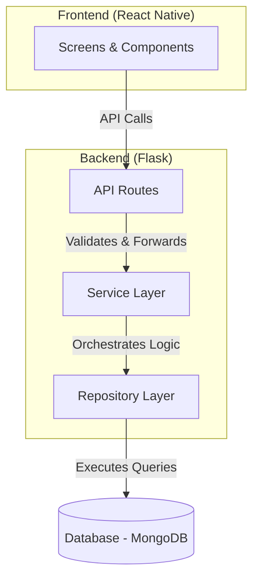
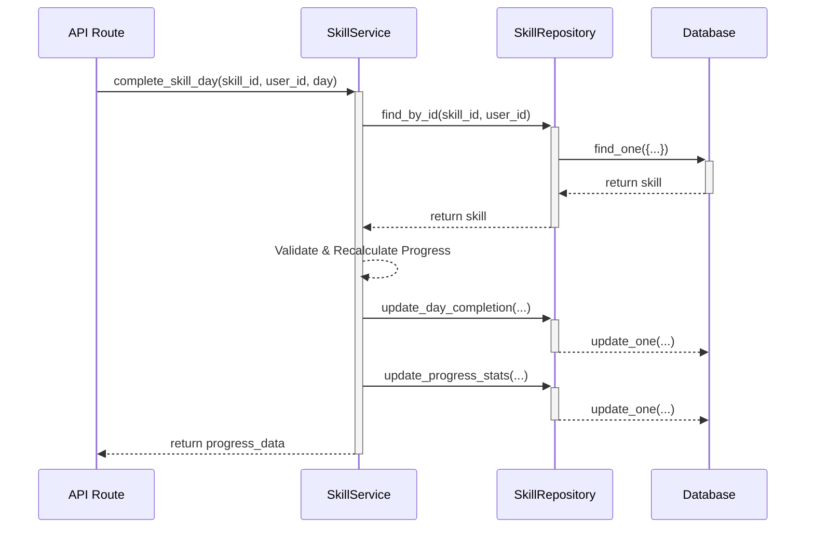
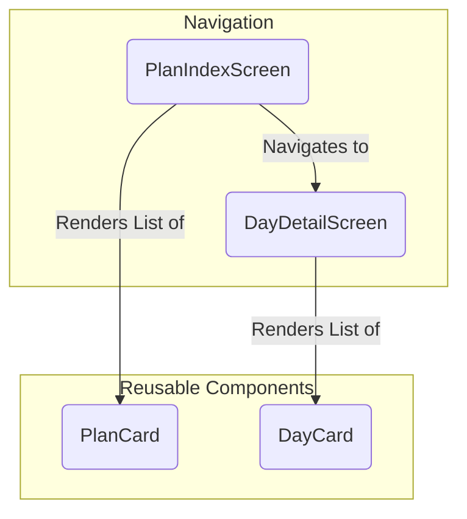

# YiZ Planner: A Guide to Plan Management

Welcome to the implementation guide for completing the Plan Management feature. This guide will walk you through adding **Read, Update, and Delete (RUD)** functionality for "Plans" to the existing application.

We will follow the established architecture, building from the database layer up to the user interface.

### Feature Architecture Overview

Here is a high-level look at how the different parts of the application interact to deliver this feature.



---

## Part 1: Backend - Repositories

> **Educational Goal:** Understand the Repository layer's role as the exclusive data access point. It translates business needs into database queries, abstracting the "how" of data retrieval from the "what" of the business logic.

We will add methods to `SkillRepository` and `HabitRepository` to handle finding, updating, and deleting documents.

### Step 1.1: Implement `SkillRepository`

We need methods to find skills by user or ID, update day completion, and delete a skill.

```python
# backend/repositories/skill_repository.py
from bson import ObjectId
from pymongo.results import InsertOneResult, UpdateResult, DeleteResult
from datetime import datetime

class SkillRepository:
    def __init__(self, db_collection):
        self.collection = db_collection

    async def create(self, skill_data: dict) -> dict:
        result: InsertOneResult = self.collection.insert_one(skill_data)
        return self.collection.find_one({"_id": result.inserted_id})

    async def find_by_user(self, user_id: str) -> list:
        return list(self.collection.find({"user_id": user_id}))

    async def find_by_id(self, skill_id: str, user_id: str) -> dict:
        return self.collection.find_one({
            "_id": ObjectId(skill_id), 
            "user_id": user_id
        })

    async def update_day_completion(self, skill_id: str, user_id: str, day_number: int) -> UpdateResult:
        return self.collection.update_one(
            {"_id": ObjectId(skill_id), "user_id": user_id},
            {"$set": { f"curriculum.days.{day_number - 1}.completed": True, "updated_at": datetime.utcnow()}}
        )

    async def update_progress_stats(self, skill_id: str, user_id: str, progress_data: dict) -> UpdateResult:
        return self.collection.update_one(
            {"_id": ObjectId(skill_id), "user_id": user_id},
            {"$set": {"progress": progress_data, "updated_at": datetime.utcnow()}}
        )

    async def delete_by_id(self, skill_id: str, user_id: str) -> DeleteResult:
        return self.collection.delete_one({
            "_id": ObjectId(skill_id), 
            "user_id": user_id
        })
```
**Key Design Choices:**
-   **Security**: Methods like `find_by_id` and `delete_by_id` query by **both `_id` and `user_id`**. This is critical to prevent users from accessing or modifying another user's data.
-   **Targeted Updates**: `update_day_completion` uses MongoDB's dot notation (`"curriculum.days.N.completed"`) to modify a specific element in a nested array efficiently.

### Step 1.2: Implement `HabitRepository`
The `HabitRepository` follows a similar pattern but is tailored to the data structure of habits, which track streaks instead of daily curriculum progress.

```python
# backend/repositories/habit_repository.py
from bson import ObjectId
from pymongo.results import InsertOneResult, UpdateResult, DeleteResult
from datetime import datetime

class HabitRepository:
    def __init__(self, db_collection):
        self.collection = db_collection

    async def create(self, habit_data: dict) -> dict:
        result: InsertOneResult = self.collection.insert_one(habit_data)
        return self.collection.find_one({"_id": result.inserted_id})

    async def find_by_user(self, user_id: str) -> list:
        return list(self.collection.find({"user_id": user_id}))

    async def find_by_id(self, habit_id: str, user_id: str) -> dict:
        return self.collection.find_one({
            "_id": ObjectId(habit_id), 
            "user_id": user_id
        })

    async def update_streaks(self, habit_id: str, user_id: str, streak_data: dict) -> UpdateResult:
        return self.collection.update_one(
            {"_id": ObjectId(habit_id), "user_id": user_id},
            {"$set": {"streaks": streak_data, "updated_at": datetime.utcnow()}}
        )

    async def delete_by_id(self, habit_id: str, user_id: str) -> DeleteResult:
        return self.collection.delete_one({
            "_id": ObjectId(habit_id), 
            "user_id": user_id
        })
```

---
## Part 2: Backend - Services & API

> **Educational Goal:** Understand the division of labor. The **Service Layer** holds business logic (e.g., "how is progress calculated?"). The **API Layer** handles HTTP concerns (e.g., "is this user authenticated? what does the JSON response look like?").

### Request Flow Visualization
This sequence diagram shows how a "complete day" request flows through the backend layers:



### Step 2.1: Update `SkillService`
Add these methods to `backend/services/skill_service.py` to handle the business logic for fetching, updating, and deleting skills.

```python
# Add to SkillService class in backend/services/skill_service.py

@staticmethod
async def get_user_skills(user_id: str) -> list:
    repository = SkillRepository(g.db.skills)
    skills = await repository.find_by_user(user_id)
    for skill in skills:
        skill['_id'] = str(skill['_id'])
    return skills

@staticmethod
async def get_skill_by_id(skill_id: str, user_id: str) -> dict:
    repository = SkillRepository(g.db.skills)
    skill = await repository.find_by_id(skill_id, user_id)
    if not skill:
        raise ValueError("Skill not found or access denied")
    skill['_id'] = str(skill['_id'])
    return skill

@staticmethod
async def complete_skill_day(skill_id: str, user_id: str, day_number: int) -> dict:
    repository = SkillRepository(g.db.skills)
    skill = await repository.find_by_id(skill_id, user_id)
    
    if not skill:
        raise ValueError("Skill not found or access denied")
    if not (1 <= day_number <= 30):
        raise ValueError("Day number must be between 1 and 30")
    if skill['curriculum']['days'][day_number - 1].get('completed', False):
        raise ValueError("Day is already completed")
    
    await repository.update_day_completion(skill_id, user_id, day_number)
    
    # Recalculate progress statistics
    completed_days = sum(1 for day in skill['curriculum']['days'] if day.get('completed', False)) + 1
    progress_data = {
        "completed_days": completed_days,
        "completion_percentage": round((completed_days / 30) * 100, 2),
        "current_day": min(day_number + 1, 30),
        "last_accessed": datetime.utcnow()
    }
    await repository.update_progress_stats(skill_id, user_id, progress_data)
    return progress_data

@staticmethod
async def delete_skill(skill_id: str, user_id: str) -> bool:
    repository = SkillRepository(g.db.skills)
    if not await repository.find_by_id(skill_id, user_id):
        raise ValueError("Skill not found or access denied")
    result = await repository.delete_by_id(skill_id, user_id)
    return result.deleted_count > 0
```

### Step 2.2: Update `HabitService`
The `HabitService` needs corresponding methods. Note that deleting a habit should also delete its associated check-ins, a key piece of business logic.

```python
# Add to HabitService class in backend/services/habit_service.py

@staticmethod
async def get_user_habits(user_id: str) -> list:
    repository = HabitRepository(g.db.habits)
    habits = await repository.find_by_user(user_id)
    for habit in habits:
        habit['_id'] = str(habit['_id'])
    return habits

@staticmethod
async def get_habit_by_id(habit_id: str, user_id: str) -> dict:
    repository = HabitRepository(g.db.habits)
    habit = await repository.find_by_id(habit_id, user_id)
    if not habit:
        raise ValueError("Habit not found or access denied")
    habit['_id'] = str(habit['_id'])
    return habit

@staticmethod
async def delete_habit(habit_id: str, user_id: str) -> bool:
    habit_repo = HabitRepository(g.db.habits)
    checkin_repo = CheckinRepository(g.db.habit_checkins)
    
    if not await habit_repo.find_by_id(habit_id, user_id):
        raise ValueError("Habit not found or access denied")
    
    # Business Rule: Delete associated check-ins
    await checkin_repo.delete_by_habit_id(habit_id, user_id)
    
    result = await habit_repo.delete_by_id(habit_id, user_id)
    return result.deleted_count > 0
```

### Step 2.3: Create API Endpoints
Expose the service methods via new routes in `backend/api/v1/plans.py`.

| Method | Endpoint                                               | Description                                |
|:-------|:-------------------------------------------------------|:-------------------------------------------|
| `GET`    | `/`                                                    | Get all skills and habits for the user.    |
| `GET`    | `/skills/<skill_id>`                                   | Get details for a specific skill.          |
| `DELETE` | `/skills/<skill_id>`                                   | Delete a specific skill.                   |
| `PATCH`  | `/skills/<skill_id>/days/<day_number>/complete`        | Mark a day as complete for a skill.      |
| `GET`    | `/habits/<habit_id>`                                   | Get details for a specific habit.          |
| `DELETE` | `/habits/<habit_id>`                                   | Delete a habit and its check-ins.        |

Add the corresponding route handler functions to `plans.py`, ensuring each is protected with `@require_auth`.

---

## Part 3: Frontend - API Client

> **Educational Goal:** Centralize API communication in a dedicated module. This keeps UI components clean of HTTP logic and makes the API easy to manage.

```mermaid
graph TD
    subgraph "React App"
        A[UI Components]
        B[API Client Module<br>(plans.js)]
    end
    subgraph "Backend Server"
        C[Backend API]
    end

    A -- "getAllPlans(token)" --> B
    B -- "GET /api/v1/plans" --> C
```

### Step 3.1: Expand `plans.js`
Add the following functions to `frontend/src/api/plans.js` to communicate with the new backend endpoints.

```javascript
// Add to frontend/src/api/plans.js
import axios from 'axios';
import { API_BASE_URL } from './apiConfig';

// Assumes generatePlan already exists

export const getAllPlans = async (token) => {
  const response = await axios.get(`${API_BASE_URL}/api/v1/plans`, {
    headers: { 'Authorization': `Bearer ${token}` }
  });
  return response.data;
};

export const getSkillById = async (skillId, token) => {
  const response = await axios.get(`${API_BASE_URL}/api/v1/plans/skills/${skillId}`, {
    headers: { 'Authorization': `Bearer ${token}` }
  });
  return response.data;
};

export const deleteSkill = async (skillId, token) => {
  const response = await axios.delete(`${API_BASE_URL}/api/v1/plans/skills/${skillId}`, {
    headers: { 'Authorization': `Bearer ${token}` }
  });
  return response.data;
};

export const deleteHabit = async (habitId, token) => {
  const response = await axios.delete(`${API_BASE_URL}/api/v1/plans/habits/${habitId}`, {
    headers: { 'Authorization': `Bearer ${token}` }
  });
  return response.data;
};

export const markSkillDayComplete = async (skillId, dayNumber, token) => {
  const response = await axios.patch(
    `${API_BASE_URL}/api/v1/plans/skills/${skillId}/days/${dayNumber}/complete`, 
    {}, // No body needed for this request
    { headers: { 'Authorization': `Bearer ${token}` } }
  );
  return response.data;
};

// ... and other API functions
```
**Key Pattern**: Each function wraps an `axios` call, includes the auth token, and returns `response.data`. Errors are implicitly thrown by `axios` on non-2xx responses and should be caught in the UI layer with `try/catch`.

---

## Part 4: Frontend - User Interface

> **Educational Goal:** Use React concepts like state, effects, and context to build a dynamic and interactive UI that reflects the data from our backend.

### Component & Navigation Flow



### Step 4.1: `PlanIndexScreen`
This screen lists all user plans and handles deletion. It fetches data on load and when focused.

**Key Features:**
-   **Data Fetching**: `useEffect` and `useIsFocused` trigger `getAllPlans`.
-   **State Management**: `useState` holds `skills`, `habits`, and `loading` state.
-   **User Actions**: `handleDelete` shows a confirmation `Alert` before calling the API.
-   **Navigation**: `PlanCard` navigates to the detail screen on press.

*(The code for `PlanIndexScreen.jsx` remains largely the same as in the original guide but is now understood within this more visual context.)*


### Step 4.2: `DayDetailScreen`
This screen displays the 30-day curriculum for a single skill and allows users to mark days complete.

**Key Features:**
-   **Data Fetching**: Fetches a single skill's data using the `skillId` from route params.
-   **Optimistic UI**: When a day is marked complete, the UI updates instantly (`setSkill`). The API call happens in the background. If it fails, the UI reverts to its original state, providing a snappy user experience.

*(The code for `DayDetailScreen.jsx` remains largely the same.)*

### Step 4.3: Update Navigation
Finally, ensure the new screens are registered in your navigator (e.g., in `App.js`).

**Navigation Stack:**
```
- Stack.Navigator
  - (If Logged In)
    - Stack.Screen (name="PlanIndex", options={{ title: 'My Plans' }})
    - Stack.Screen (name="SkillDetail", options={{ title: 'Skill Details' }})
    - ... other screens
  - (If Logged Out)
    - ... login screens
```
This configuration ensures users can navigate from the `PlanIndexScreen` to the `DayDetailScreen` to see their skill curriculum.

This completes the full implementation of the Plan Management feature. Congratulations! 