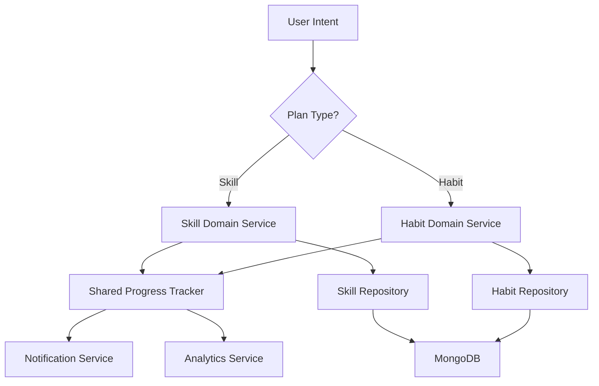

# 🚀 YiZ Planner: Skills & Habits Architecture
## Optimized Solution Document

*Version: 2.0 | Date: June 13, 2025*

---

## 🎯 Executive Summary

This document presents an optimized architecture for extending YiZ Planner to support both **Skills** (finite learning curricula) and **Habits/Talents** (continuous development patterns). The solution emphasizes clean separation of concerns, progressive enhancement, and maintainable code patterns.

### 🏆 Key Improvements Over Previous Proposal

| Area | Previous Approach | Optimized Approach |
|------|-------------------|-------------------|
| **Data Model** | Single collection with discriminants | Separate collections with shared interfaces |
| **Type Safety** | Runtime checks | TypeScript/Schema-first design |
| **Scalability** | Monolithic services | Modular, composable services |
| **User Experience** | Generic UI components | Specialized, context-aware interfaces |
| **Testing** | Integration-heavy | Unit-testable, mockable services |

---

## 🏗️ Architectural Philosophy

### 🎭 Domain-Driven Design Principles

Instead of forcing two different concepts into one data structure, we'll embrace their fundamental differences while sharing common infrastructure:

```
Skills: Finite → Progress-based → Completion-oriented → Structured curriculum
Habits: Infinite → Consistency-based → Streak-oriented → Flexible patterns
```

### 🧩 Composable Architecture



### 💡 Core Concepts Explained
> **Developer's Note:** This section explains the "why" behind our high-level approach.
>
> **Domain-Driven Design (DDD):** Think of this like creating blueprints for different types of vehicles. Instead of one giant "Vehicle" blueprint for cars, boats, and planes, DDD encourages us to create separate, highly detailed blueprints for each. A car blueprint has specifics about wheels and engines; a boat blueprint details hulls and rudders. They might share some concepts (like `color` or `max_passengers`), but they are treated as distinct domains because their behaviors are fundamentally different. In our app, **Skills** and **Habits** are our distinct domains. This clarity prevents us from writing confusing code that tries to cater to every possibility at once.
>
> **Composable Architecture:** This is like building with LEGOs. Each service in the diagram (like `Progress Tracker` or `Notification Service`) is a standard LEGO brick with a specific function. We can connect them in various ways to build new features without having to invent a new type of brick each time. If we want to add "Weekly Summary Emails," we can simply connect our `Analytics Service` to a new `Email Service`. This makes the system flexible, predictable, and easy to extend.

---

## 📊 Data Architecture

### 🗄️ Database Design: Separate Collections, Shared Patterns

Rather than using discriminants in a single collection, we'll use separate collections that implement common interfaces:

#### Skills Collection
```javascript
{
  _id: ObjectId,
  user_id: ObjectId,          // Foreign key
  title: String,              // "Master Python in 30 Days"
  skill_name: String,         // "Python Programming" 
  difficulty: "beginner" | "intermediate" | "advanced",
  
  // Curriculum Structure
  curriculum: {
    total_days: Number,       // Usually 30, but flexible
    days: [
      {
        day_number: Number,
        title: String,
        tasks: [String],
        resources: [String],
        estimated_time: Number, // minutes
        completed: Boolean,
        completed_at: ISODate
      }
    ]
  },
  
  // Progress Tracking
  progress: {
    current_day: Number,
    completed_days: Number,
    completion_percentage: Number,
    started_at: ISODate,
    last_activity: ISODate,
    projected_completion: ISODate
  },
  
  // Metadata
  status: "draft" | "active" | "paused" | "completed" | "abandoned",
  created_at: ISODate,
  updated_at: ISODate,
  
  // AI Generation Metadata
  generation_meta: {
    model_used: String,
    generated_at: ISODate,
    customizations: Object
  }
}
```

#### Habits Collection
```javascript
{
  _id: ObjectId,
  user_id: ObjectId,
  title: String,              // "Daily Meditation"
  category: "health" | "productivity" | "learning" | "creative" | "social",
  
  // Habit Configuration
  pattern: {
    frequency: "daily" | "weekly" | "custom",
    target_days: [0,1,2,3,4,5,6], // Days of week (0=Sunday)
    target_time: String,      // "07:00" for suggested time
    duration_minutes: Number, // Expected time investment
    custom_schedule: Object   // For complex patterns
  },
  
  // Progress Tracking
  streaks: {
    current_streak: Number,
    longest_streak: Number,
    total_completions: Number,
    success_rate_30d: Number, // Percentage over last 30 days
    last_completion: ISODate
  },
  
  // Goal Setting
  goals: {
    target_streak: Number,    // Optional goal (e.g., 66 days)
    milestone_rewards: [
      {
        days: Number,
        reward: String,
        achieved: Boolean,
        achieved_at: ISODate
      }
    ]
  },
  
  // Check-in History (separate sub-collection for performance)
  status: "active" | "paused" | "completed" | "archived",
  created_at: ISODate,
  updated_at: ISODate
}
```

#### Check-ins Sub-collection (for Habits)
```javascript
// Collection: habit_checkins
{
  _id: ObjectId,
  habit_id: ObjectId,
  user_id: ObjectId,
  date: ISODate,              // Date of completion (YYYY-MM-DD)
  completed: Boolean,
  quality_rating: Number,     // 1-5 scale (optional)
  notes: String,              // Optional reflection
  duration_actual: Number,    // Actual time spent (minutes)
  created_at: ISODate
}
```

### 🔍 Database Indexes

```javascript
// Skills Collection
db.skills.createIndex({ user_id: 1, status: 1 })
db.skills.createIndex({ user_id: 1, "progress.current_day": 1 })
db.skills.createIndex({ created_at: -1 })

// Habits Collection  
db.habits.createIndex({ user_id: 1, status: 1 })
db.habits.createIndex({ user_id: 1, "pattern.frequency": 1 })

// Check-ins Collection
db.habit_checkins.createIndex({ habit_id: 1, date: -1 })
db.habit_checkins.createIndex({ user_id: 1, date: -1 })
db.habit_checkins.createIndex({ habit_id: 1, user_id: 1, date: 1 }, { unique: true })
```

### 💡 Design Rationale
> **Developer's Note:** The database structure is the foundation of our entire application. A well-designed foundation prevents future cracks.
>
> **Why Separate Collections?** We are intentionally keeping `skills` and `habits` in different collections. Trying to force them into a single collection is like trying to fit a square peg in a round hole. A **Skill** is finite, with a defined start and end. A **Habit** is continuous, focused on streaks and consistency. By separating them, our queries are simpler, our data is cleaner, and our code is more intuitive.
>
> **Why a separate `habit_checkins` collection?** Performance. A user might stick with a daily habit for years, generating thousands of check-in records. If we stored these check-ins inside an array on the main `habit` document, that document would become enormous and slow to load. By keeping them separate, loading a user's list of habits remains instantaneous. We only query the `habit_checkins` collection when a user explicitly wants to view their history for a *specific* habit.
>
> **What are Database Indexes?** Think of an index as the index in the back of a textbook. If you want to find information about "Mitochondria," you don't scan every single page. You go to the index, find "Mitochondria," and it gives you the exact page numbers. A database index does the same thing. When we tell MongoDB to `createIndex({ user_id: 1 })`, it creates a special, sorted list of all user IDs. When we ask for "all plans for user 'X'", the database uses this index to find them instantly, which is a performance superpower.

---

## 🎯 Service Layer Architecture

### 🧱 Base Classes and Interfaces

```python
# backend/models/base.py
from abc import ABC, abstractmethod
from dataclasses import dataclass
from datetime import datetime
from typing import Dict, Any, Optional

@dataclass
class BasePlan(ABC):
    """Abstract base for all plan types"""
    user_id: str
    title: str
    status: str
    created_at: datetime
    updated_at: datetime
    
    @abstractmethod
    def get_progress_summary(self) -> Dict[str, Any]:
        """Return progress information specific to plan type"""
        pass
    
    @abstractmethod
    def can_be_marked_complete(self) -> bool:
        """Check if plan can be completed"""
        pass

@dataclass  
class SkillPlan(BasePlan):
    skill_name: str
    curriculum: Dict[str, Any]
    progress: Dict[str, Any]
    difficulty: str
    
    def get_progress_summary(self) -> Dict[str, Any]:
        return {
            "type": "skill",
            "current_day": self.progress.get("current_day", 1),
            "completion_percentage": self.progress.get("completion_percentage", 0),
            "days_remaining": self.curriculum["total_days"] - self.progress.get("completed_days", 0)
        }
    
    def can_be_marked_complete(self) -> bool:
        return self.progress.get("completed_days", 0) >= self.curriculum["total_days"]

@dataclass
class HabitPlan(BasePlan):
    category: str
    pattern: Dict[str, Any]
    streaks: Dict[str, Any]
    goals: Dict[str, Any]
    
    def get_progress_summary(self) -> Dict[str, Any]:
        return {
            "type": "habit", 
            "current_streak": self.streaks.get("current_streak", 0),
            "success_rate": self.streaks.get("success_rate_30d", 0),
            "next_milestone": self._get_next_milestone()
        }
    
    def can_be_marked_complete(self) -> bool:
        # Habits are never "complete" in traditional sense
        target_streak = self.goals.get("target_streak")
        if target_streak:
            return self.streaks.get("current_streak", 0) >= target_streak
        return False
        
    def _get_next_milestone(self) -> Optional[Dict]:
        current_streak = self.streaks.get("current_streak", 0)
        for milestone in self.goals.get("milestone_rewards", []):
            if not milestone.get("achieved", False) and milestone["days"] > current_streak:
                return milestone
        return None
```

### 🔧 Domain Services

```python
# backend/services/skill_service.py
from typing import List, Optional, Dict, Any
from datetime import datetime, timedelta
from ..models.base import SkillPlan
from ..repositories.skill_repository import SkillRepository
from .ai_service import AIService

class SkillService:
    def __init__(self, repository: SkillRepository, ai_service: AIService):
        self.repository = repository
        self.ai_service = ai_service
    
    async def create_skill_plan(
        self, 
        user_id: str, 
        title: str, 
        skill_name: str, 
        difficulty: str = "beginner",
        custom_duration: int = 30
    ) -> SkillPlan:
        """Create a new skill learning plan with AI-generated curriculum"""
        
        # Generate curriculum using AI
        curriculum = await self.ai_service.generate_skill_curriculum(
            skill_name=skill_name,
            difficulty=difficulty,
            duration_days=custom_duration
        )
        
        # Calculate projected completion
        projected_completion = datetime.utcnow() + timedelta(days=custom_duration)
        
        skill_data = {
            "user_id": user_id,
            "title": title,
            "skill_name": skill_name,
            "difficulty": difficulty,
            "curriculum": curriculum,
            "progress": {
                "current_day": 1,
                "completed_days": 0,
                "completion_percentage": 0,
                "started_at": datetime.utcnow(),
                "last_activity": datetime.utcnow(),
                "projected_completion": projected_completion
            },
            "status": "active",
            "created_at": datetime.utcnow(),
            "updated_at": datetime.utcnow()
        }
        
        return await self.repository.create(skill_data)
    
    async def mark_day_complete(
        self, 
        user_id: str, 
        skill_id: str, 
        day_number: int
    ) -> SkillPlan:
        """Mark a specific day as completed and update progress"""
        
        skill = await self.repository.get_by_id_and_user(skill_id, user_id)
        if not skill:
            raise ValueError("Skill not found or access denied")
        
        # Update the specific day
        for day in skill.curriculum["days"]:
            if day["day_number"] == day_number:
                if not day.get("completed", False):
                    day["completed"] = True
                    day["completed_at"] = datetime.utcnow()
                    break
        
        # Recalculate progress
        completed_days = sum(1 for day in skill.curriculum["days"] if day.get("completed", False))
        total_days = skill.curriculum["total_days"]
        
        skill.progress.update({
            "completed_days": completed_days,
            "completion_percentage": (completed_days / total_days) * 100,
            "current_day": min(day_number + 1, total_days),
            "last_activity": datetime.utcnow()
        })
        
        # Check if skill is completed
        if completed_days >= total_days:
            skill.status = "completed"
        
        skill.updated_at = datetime.utcnow()
        
        return await self.repository.update(skill)
    
    async def get_user_skills(
        self, 
        user_id: str, 
        status: Optional[str] = None,
        page: int = 1,
        limit: int = 20
    ) -> Dict[str, Any]:
        """Get paginated list of user's skills with filtering"""
        
        return await self.repository.get_by_user_paginated(
            user_id=user_id,
            status=status,
            page=page,
            limit=limit
        )
```

```python
# backend/services/habit_service.py
from typing import List, Optional, Dict, Any
from datetime import datetime, date, timedelta
from ..models.base import HabitPlan
from ..repositories.habit_repository import HabitRepository
from ..repositories.checkin_repository import CheckinRepository

class HabitService:
    def __init__(self, habit_repo: HabitRepository, checkin_repo: CheckinRepository):
        self.habit_repo = habit_repo
        self.checkin_repo = checkin_repo
    
    async def create_habit_plan(
        self,
        user_id: str,
        title: str,
        category: str,
        frequency: str = "daily",
        target_days: List[int] = None,
        target_streak: Optional[int] = None
    ) -> HabitPlan:
        """Create a new habit tracking plan"""
        
        if target_days is None:
            target_days = list(range(7))  # Every day by default
        
        habit_data = {
            "user_id": user_id,
            "title": title,
            "category": category,
            "pattern": {
                "frequency": frequency,
                "target_days": target_days,
                "target_time": None,
                "duration_minutes": 15  # Default 15 minutes
            },
            "streaks": {
                "current_streak": 0,
                "longest_streak": 0,
                "total_completions": 0,
                "success_rate_30d": 0,
                "last_completion": None
            },
            "goals": {
                "target_streak": target_streak,
                "milestone_rewards": self._generate_default_milestones(target_streak)
            },
            "status": "active",
            "created_at": datetime.utcnow(),
            "updated_at": datetime.utcnow()
        }
        
        return await self.habit_repo.create(habit_data)
    
    async def record_checkin(
        self,
        user_id: str,
        habit_id: str,
        completion_date: date,
        quality_rating: Optional[int] = None,
        notes: Optional[str] = None,
        duration_actual: Optional[int] = None
    ) -> Dict[str, Any]:
        """Record a habit completion for a specific date"""
        
        habit = await self.habit_repo.get_by_id_and_user(habit_id, user_id)
        if not habit:
            raise ValueError("Habit not found or access denied")
        
        # Create or update check-in record
        checkin_data = {
            "habit_id": habit_id,
            "user_id": user_id,
            "date": completion_date,
            "completed": True,
            "quality_rating": quality_rating,
            "notes": notes,
            "duration_actual": duration_actual,
            "created_at": datetime.utcnow()
        }
        
        checkin = await self.checkin_repo.upsert_by_date(checkin_data)
        
        # Update habit streaks and statistics
        await self._update_habit_statistics(habit)
        
        return {
            "checkin": checkin,
            "habit": habit,
            "streak_updated": True
        }
    
    async def _update_habit_statistics(self, habit: HabitPlan) -> HabitPlan:
        """Recalculate all habit statistics based on check-in history"""
        
        # Get recent check-ins
        recent_checkins = await self.checkin_repo.get_recent_for_habit(
            habit.id, 
            days=90
        )
        
        # Calculate current streak
        current_streak = self._calculate_current_streak(recent_checkins, habit.pattern)
        
        # Calculate 30-day success rate
        thirty_day_checkins = [c for c in recent_checkins if c.date >= date.today() - timedelta(days=30)]
        success_rate_30d = self._calculate_success_rate(thirty_day_checkins, habit.pattern, 30)
        
        # Update habit statistics
        habit.streaks.update({
            "current_streak": current_streak,
            "longest_streak": max(habit.streaks.get("longest_streak", 0), current_streak),
            "total_completions": len([c for c in recent_checkins if c.completed]),
            "success_rate_30d": success_rate_30d,
            "last_completion": recent_checkins[0].date if recent_checkins else None
        })
        
        # Check milestone achievements
        self._check_milestone_achievements(habit)
        
        habit.updated_at = datetime.utcnow()
        return await self.habit_repo.update(habit)
    
    def _generate_default_milestones(self, target_streak: Optional[int]) -> List[Dict]:
        """Generate default milestone rewards"""
        milestones = [
            {"days": 7, "reward": "First Week Champion! 🎉", "achieved": False},
            {"days": 21, "reward": "Habit Formation Master! 🏆", "achieved": False},
            {"days": 30, "reward": "Monthly Consistency King! 👑", "achieved": False},
            {"days": 66, "reward": "Habit Automation Expert! 🤖", "achieved": False},
            {"days": 100, "reward": "Century Club Member! 💯", "achieved": False}
        ]
        
        if target_streak and target_streak not in [m["days"] for m in milestones]:
            milestones.append({
                "days": target_streak,
                "reward": f"Personal Goal Achieved! 🎯",
                "achieved": False
            })
        
        return sorted(milestones, key=lambda x: x["days"])
```

### 💡 Design Rationale
> **Developer's Note:** If the database is the foundation, the Service Layer is the "brains" of the operation. It's where all the business rules and logic live, completely separate from the web layer.
>
> **What is a Service Layer?** It's a layer of Python code that sits between the API endpoints and the database. Its job is to orchestrate complex operations. The API layer might say "the user wants to create a skill plan," and it's the `SkillService`'s job to handle all the steps: call the AI service, format the curriculum, set the default progress, and save it to the database.
>
> **Why do we need it? (Separation of Concerns):** This is the most important concept. Imagine a restaurant kitchen.
> - The **API Layer** is the *waiter*. They take the order from the customer (the HTTP request) and bring the food back. They don't know how to cook.
> - The **Service Layer** is the *head chef*. They receive the order from the waiter, decide how to cook the dish (the business logic), and tell the other chefs what to do.
> - The **Repository Layer** (classes used by our services) are the *sous chefs*. They are specialists who know exactly where to get the ingredients (the database) and how to prepare them (perform `find` or `update` operations).
>
> By keeping these roles separate, our codebase is incredibly clean, easy to test (we can test the chef's recipes without needing a real waiter), and easy to modify.
>
> **What is `BasePlan`? (An Abstract Class):** Think of `BasePlan` as a "contract" or a "template." It dictates that any object we consider a "plan" in our system *must* have a title and *must* be able to report its progress (`get_progress_summary`). This enforces consistency and prevents future errors if we decide to add a third type of plan.

---

## 🌐 API Design

### 🛣️ RESTful Routes

```
POST   /api/v1/plans/skills              # Create skill plan
GET    /api/v1/plans/skills              # List user's skills
GET    /api/v1/plans/skills/{id}         # Get specific skill
PATCH  /api/v1/plans/skills/{id}/days/{day}/complete  # Mark day complete
DELETE /api/v1/plans/skills/{id}         # Archive skill

POST   /api/v1/plans/habits              # Create habit plan  
GET    /api/v1/plans/habits              # List user's habits
GET    /api/v1/plans/habits/{id}         # Get specific habit
POST   /api/v1/plans/habits/{id}/checkin # Record habit completion
GET    /api/v1/plans/habits/{id}/history # Get completion history
DELETE /api/v1/plans/habits/{id}         # Archive habit

GET    /api/v1/plans/dashboard           # Combined dashboard data
```

### 🔧 Flask Blueprint Implementation

```python
# backend/api/v1/plans.py
from flask import Blueprint, request, jsonify, g
from marshmallow import ValidationError
from ...services.skill_service import SkillService
from ...services.habit_service import HabitService
from ...auth.decorators import require_auth
from ...schemas.plan_schemas import SkillCreateSchema, HabitCreateSchema

plans_bp = Blueprint('plans', __name__, url_prefix='/api/v1/plans')

# Dependency injection
def get_skill_service():
    # Factory function to create service with dependencies
    pass

def get_habit_service():
    # Factory function to create service with dependencies  
    pass

@plans_bp.route('/skills', methods=['POST'])
@require_auth
async def create_skill():
    try:
        schema = SkillCreateSchema()
        data = schema.load(request.json)
        
        service = get_skill_service()
        skill = await service.create_skill_plan(
            user_id=g.current_user['_id'],
            **data
        )
        
        return jsonify({
            "status": "success",
            "data": skill.to_dict(),
            "message": "Skill plan created successfully"
        }), 201
        
    except ValidationError as e:
        return jsonify({
            "status": "error", 
            "errors": e.messages
        }), 422
    except Exception as e:
        return jsonify({
            "status": "error",
            "message": str(e)
        }), 500

@plans_bp.route('/skills/<skill_id>/days/<int:day_number>/complete', methods=['PATCH'])
@require_auth
async def mark_skill_day_complete(skill_id, day_number):
    try:
        service = get_skill_service()
        skill = await service.mark_day_complete(
            user_id=g.current_user['_id'],
            skill_id=skill_id,
            day_number=day_number
        )
        
        return jsonify({
            "status": "success",
            "data": skill.to_dict(),
            "message": f"Day {day_number} marked as complete"
        })
        
    except ValueError as e:
        return jsonify({
            "status": "error",
            "message": str(e)
        }), 404
    except Exception as e:
        return jsonify({
            "status": "error", 
            "message": str(e)
        }), 500

@plans_bp.route('/habits/<habit_id>/checkin', methods=['POST'])
@require_auth
async def habit_checkin(habit_id):
    try:
        data = request.json or {}
        
        service = get_habit_service()
        result = await service.record_checkin(
            user_id=g.current_user['_id'],
            habit_id=habit_id,
            completion_date=data.get('date', date.today()),
            quality_rating=data.get('quality_rating'),
            notes=data.get('notes'),
            duration_actual=data.get('duration_actual')
        )
        
        return jsonify({
            "status": "success",
            "data": result,
            "message": "Check-in recorded successfully"
        })
        
    except Exception as e:
        return jsonify({
            "status": "error",
            "message": str(e)
        }), 500
```

### 💡 Design Rationale
> **Developer's Note:** The API is the public "front door" for our backend. It is the only way the frontend application is allowed to communicate with our services and database.
>
> **RESTful Routes:** This is the universal language for web APIs. Using standard HTTP verbs (`GET`, `POST`, `PATCH`, `DELETE`) to mean "read," "create," "update," and "remove" makes our API predictable and easy for any developer to understand.
>
> **Flask Blueprint (`plans_bp`):** This is simply an organizational tool. As our app grows, we might have dozens of routes. Blueprints allow us to group related routes into separate files (e.g., `plans.py`, `users.py`, `analytics.py`), keeping our main application file clean and tidy.
>
> **The `@require_auth` Decorator:** This is our **security guard**. It stands in front of every route that needs protection. Before the route's code can even run, the decorator checks the incoming request for a valid JWT. If the token is missing, invalid, or expired, the decorator immediately sends back a "401 Unauthorized" error and blocks access.
>
> **Validation Schemas (`SkillCreateSchema`):** This is our API's **doorman** or **bouncer**. Before the data from a request is passed to our service layer, the schema checks its "ID." It ensures all required fields are present, that data types are correct (e.g., a `day_number` is an integer), and that no malicious or unexpected data gets through. This catches a huge number of potential bugs and security issues right at the entrance.

---

## 📱 Frontend Architecture

### 🎯 State Management Strategy

Instead of stuffing everything into `AuthContext`, we'll create specialized contexts:

```javascript
// src/contexts/PlansContext.js
import React, { createContext, useContext, useReducer } from 'react';

const PlansContext = createContext();

const initialState = {
  skills: [],
  habits: [],
  loading: false,
  error: null,
  activeFilters: {
    skills: { status: 'active' },
    habits: { status: 'active' }
  }
};

function plansReducer(state, action) {
  switch (action.type) {
    case 'FETCH_PLANS_START':
      return { ...state, loading: true, error: null };
      
    case 'FETCH_SKILLS_SUCCESS':
      return { 
        ...state, 
        loading: false, 
        skills: action.payload.plans,
        pagination: { ...state.pagination, skills: action.payload.pagination }
      };
      
    case 'FETCH_HABITS_SUCCESS':
      return { 
        ...state, 
        loading: false, 
        habits: action.payload.plans,
        pagination: { ...state.pagination, habits: action.payload.pagination }
      };
      
    case 'UPDATE_SKILL_PROGRESS':
      return {
        ...state,
        skills: state.skills.map(skill => 
          skill.id === action.payload.id 
            ? { ...skill, progress: action.payload.progress }
            : skill
        )
      };
      
    case 'ADD_HABIT_CHECKIN':
      return {
        ...state,
        habits: state.habits.map(habit =>
          habit.id === action.payload.habitId
            ? { ...habit, streaks: action.payload.updatedStreaks }
            : habit
        )
      };
      
    default:
      return state;
  }
}

export const PlansProvider = ({ children }) => {
  const [state, dispatch] = useReducer(plansReducer, initialState);
  
  // Action creators
  const fetchSkills = async (filters = {}) => {
    dispatch({ type: 'FETCH_PLANS_START' });
    try {
      const response = await plansAPI.fetchSkills(filters);
      dispatch({ type: 'FETCH_SKILLS_SUCCESS', payload: response.data });
    } catch (error) {
      dispatch({ type: 'FETCH_PLANS_ERROR', payload: error.message });
    }
  };
  
  const markSkillDayComplete = async (skillId, dayNumber) => {
    try {
      const response = await plansAPI.markSkillDayComplete(skillId, dayNumber);
      dispatch({ 
        type: 'UPDATE_SKILL_PROGRESS', 
        payload: { id: skillId, progress: response.data.progress }
      });
      return response.data;
    } catch (error) {
      dispatch({ type: 'FETCH_PLANS_ERROR', payload: error.message });
      throw error;
    }
  };
  
  return (
    <PlansContext.Provider value={{
      ...state,
      actions: {
        fetchSkills,
        fetchHabits,
        markSkillDayComplete,
        recordHabitCheckin
      }
    }}>
      {children}
    </PlansContext.Provider>
  );
};

export const usePlans = () => {
  const context = useContext(PlansContext);
  if (!context) {
    throw new Error('usePlans must be used within PlansProvider');
  }
  return context;
};
```

### 🎨 Component Architecture

```javascript
// src/screens/DashboardScreen.jsx
import React, { useState, useEffect } from 'react';
import { View, ScrollView } from 'react-native';
import { usePlans } from '../contexts/PlansContext';
import SkillsOverview from '../components/SkillsOverview';
import HabitsOverview from '../components/HabitsOverview';
import CreatePlanFAB from '../components/CreatePlanFAB';

const DashboardScreen = () => {
  const { skills, habits, loading, actions } = usePlans();
  const [activeTab, setActiveTab] = useState('overview');
  
  useEffect(() => {
    // Load initial data
    actions.fetchSkills({ status: 'active', limit: 5 });
    actions.fetchHabits({ status: 'active', limit: 5 });
  }, []);
  
  return (
    <View style={styles.container}>
      <ScrollView>
        {activeTab === 'overview' && (
          <>
            <SkillsOverview 
              skills={skills.slice(0, 3)} 
              onViewAll={() => setActiveTab('skills')}
            />
            <HabitsOverview 
              habits={habits.slice(0, 3)}
              onViewAll={() => setActiveTab('habits')}
            />
          </>
        )}
        
        {activeTab === 'skills' && (
          <SkillsList skills={skills} loading={loading} />
        )}
        
        {activeTab === 'habits' && (
          <HabitsList habits={habits} loading={loading} />
        )}
      </ScrollView>
      
      <CreatePlanFAB onPress={() => /* Navigate to creation flow */} />
    </View>
  );
};
```

### 🧩 Specialized Components

```javascript
// src/components/SkillDayCard.jsx
import React from 'react';
import { View, Text, TouchableOpacity } from 'react-native';
import { CheckCircle, Circle, Clock } from 'lucide-react-native';

const SkillDayCard = ({ day, onToggleComplete, disabled }) => {
  const isCompleted = day.completed;
  const isToday = day.day_number === getCurrentDay();
  
  return (
    <TouchableOpacity 
      style={[
        styles.dayCard,
        isCompleted && styles.completedCard,
        isToday && styles.todayCard
      ]}
      onPress={() => onToggleComplete(day.day_number)}
      disabled={disabled}
    >
      <View style={styles.dayHeader}>
        <Text style={styles.dayNumber}>Day {day.day_number}</Text>
        {isCompleted ? (
          <CheckCircle color="#10B981" size={24} />
        ) : (
          <Circle color="#6B7280" size={24} />
        )}
      </View>
      
      <Text style={styles.dayTitle}>{day.title}</Text>
      
      <View style={styles.tasksList}>
        {day.tasks.slice(0, 2).map((task, index) => (
          <Text key={index} style={styles.taskItem}>• {task}</Text>
        ))}
        {day.tasks.length > 2 && (
          <Text style={styles.moreTasksText}>
            +{day.tasks.length - 2} more tasks
          </Text>
        )}
      </View>
      
      <View style={styles.dayFooter}>
        <View style={styles.timeEstimate}>
          <Clock size={16} color="#6B7280" />
          <Text style={styles.timeText}>{day.estimated_time} min</Text>
        </View>
      </View>
    </TouchableOpacity>
  );
};
```

### 💡 Design Rationale
> **Developer's Note:** This section outlines how we manage data and build our UI in the React Native app. The goal is a responsive, predictable, and maintainable user experience.
>
> **State Management (`PlansContext`):** Think of your app's memory as a filing cabinet. A simple approach is to stuff all papers into one drawer. A better approach is to have **specialized drawers**. `AuthContext` is the drawer for "User & Login Information." `PlansContext` is the drawer for "Skills & Habits Data." This separation makes finding and managing our application's state much easier.
>
> **The Reducer Pattern (`plansReducer`):** This is like a predictable assembly line for changing our state.
> 1. The current state (the list of skills) goes in one end.
> 2. An `action` packet (e.g., `{ type: 'UPDATE_SKILL_PROGRESS', payload: ... }`) tells the machine what to do.
> 3. A **brand new, updated state** comes out the other end.
> This pattern is powerful because it prevents state from being changed randomly from anywhere in the app. All changes must go through this one, predictable channel, which eliminates a whole class of bugs.
>
> **Smart vs. Dumb Components:** This is a powerful pattern for organizing UI code. Imagine a company's hierarchy:
> - **Screen Components (Smart Components):** These are the "Managers" (e.g., `DashboardScreen`). They are aware of the big picture. They talk to other departments (make API calls via the `PlansContext`), manage their team's state, and delegate tasks to their specialists.
> - **UI Components (Dumb Components):** These are the "Specialist Employees" (e.g., `SkillDayCard`, `HabitCheckInButton`). They are given a very specific task and all the information they need to do it (their `props`). They do their job perfectly but don't need to know the company's overall strategy. This makes them highly reusable (you can use a `Button` component anywhere) and very easy to test.

---

## 🤖 AI Service Architecture

To ensure our application remains modular and adaptable, all interactions with third-party AI providers like OpenRouter will be managed through a dedicated `AIService`. This abstraction layer prevents our core business logic from being tightly coupled to a specific AI model or vendor.

### 🎯 Core Responsibilities

1.  **Abstraction**: Provides a simple, internal-facing API for AI tasks (e.g., `generate_skill_curriculum`).
2.  **Prompt Engineering**: Contains the logic for constructing detailed, effective prompts that elicit structured JSON responses from the AI.
3.  **Error Handling**: Manages API-specific errors, retries, and fallbacks.
4.  **Configuration**: Manages API keys, model names, and other AI-related settings from environment variables.

### 🔧 Interface Definition

```python
# backend/services/ai_service.py
import httpx
from typing import Dict, Any

class AIService:
    """A dedicated service to handle all interactions with the AI provider."""
    
    def __init__(self, api_key: str, model: str = "deepseek/deepseek-chat"):
        self.api_key = api_key
        self.model = model
        self.base_url = "https://openrouter.ai/api/v1"
        
    async def generate_skill_curriculum(
        self,
        skill_name: str,
        difficulty: str,
        duration_days: int
    ) -> Dict[str, Any]:
        """
        Generates a structured learning plan curriculum using OpenRouter.
        
        This method is responsible for:
        1.  Building a precise, role-based prompt.
        2.  Requesting a JSON object from the AI to minimize parsing errors.
        3.  Validating the response structure.
        """
        prompt = self._build_curriculum_prompt(skill_name, difficulty, duration_days)
        
        async with httpx.AsyncClient(timeout=90.0) as client:
            try:
                response = await client.post(
                    f"{self.base_url}/chat/completions",
                    headers={"Authorization": f"Bearer {self.api_key}"},
                    json={
                        "model": self.model,
                        "response_format": {"type": "json_object"},
                        "messages": [
                            {"role": "system", "content": "You are a world-class instructional designer..."},
                            {"role": "user", "content": prompt}
                        ]
                    }
                )
                response.raise_for_status()
                
                # Further validation to ensure the response matches our schema
                # e.g., check if 'days' is a list of the correct length
                
                return response.json()["choices"][0]["message"]["content"]
                
            except httpx.HTTPStatusError as e:
                # Log the error and raise a service-specific exception
                raise AIGenerationError(f"AI service returned an error: {e.response.status_code}")
            except Exception as e:
                raise AIGenerationError(f"An unexpected error occurred: {str(e)}")

    def _build_curriculum_prompt(self, skill_name, difficulty, duration_days) -> str:
        """Constructs the detailed prompt for the AI."""
        # This is where the magic happens. A detailed prompt is key to quality results.
        return f"""
        Generate a structured {duration_days}-day learning curriculum for the skill "{skill_name}"
        at a "{difficulty}" level.
        
        The output MUST be a single JSON object with the following structure:
        {{
          "total_days": {duration_days},
          "days": [
            {{
              "day_number": 1,
              "title": "Title for Day 1",
              "tasks": ["Task 1", "Task 2"],
              "resources": ["Resource URL or book name"],
              "estimated_time": 60
            }}
          ]
        }}
        """

class AIGenerationError(Exception):
    """Custom exception for AI service failures."""
    pass
```

### 💡 Design Rationale
> **Developer's Note:** The AI service is our gateway to external intelligence. We want to use its power without becoming dependent on a specific provider.
>
> **The Abstraction Layer:** Think of the `AIService` class as a **universal remote control**. Our application's services (like `SkillService`) don't know or care if we're using OpenRouter, OpenAI, or Google's AI. They just know how to use the buttons on our universal remote (e.g., `ai_service.generate_skill_curriculum()`).
>
> This is incredibly valuable because if we ever want to switch AI providers, we only have to update the internal wiring of the `AIService` "remote control." We don't have to change a single line of code in our core business logic. This design saves us from future headaches and vendor lock-in.

---

## 🧪 Comprehensive Testing Strategy

A robust application requires a multi-layered testing strategy to ensure reliability and enable confident refactoring. We will adopt the "Testing Pyramid" model.

### 🖥️ Backend Testing (Pytest)

1.  **Unit Tests (Fastest)**:
    -   **Services**: Test business logic in complete isolation by mocking repository dependencies. For example, in `test_skill_service.py`, we can inject a `MockSkillRepository` to verify that `mark_day_complete` correctly calculates percentages and changes status without touching a real database.
    -   **Repositories**: Test database logic against a temporary, in-memory database (`mongomock`) or a dedicated test database to validate query correctness.
    -   **Schemas**: Test `marshmallow` schemas to ensure they correctly validate valid data and reject invalid payloads with descriptive errors.

2.  **Integration Tests**:
    -   Use the Flask Test Client to send requests to the API endpoints.
    -   These tests verify the entire request-response cycle, from routing and authentication to service logic and database interaction.
    -   Example: A test that calls `POST /api/v1/plans/skills`, followed by `GET /api/v1/plans/skills/{id}` to ensure the resource was created correctly.

### 📱 Frontend Testing (Jest & React Testing Library)

1.  **Unit Tests**:
    -   Test helper functions, utility hooks, and other non-UI logic in isolation.

2.  **Component Tests**:
    -   Render individual components (`SkillDayCard`, `HabitsOverview`) with mock data and props.
    -   Use React Testing Library to simulate user interactions (`fireEvent.press`) and assert that the UI updates as expected or that the correct callbacks are invoked.
    -   Test our custom `PlansProvider` by wrapping a test component, dispatching actions, and asserting that the context's state is updated correctly.

3.  **End-to-End (E2E) Tests (Optional but Recommended)**:
    -   Frameworks like **Maestro** or **Detox** can be used to write scripts that run on a real emulator/simulator.
    -   These scripts simulate a full user journey: "Log in, navigate to dashboard, create a new habit, check in for the day, and verify the streak increases."

### 💡 Design Rationale
> **Developer's Note:** Writing tests is not a chore; it's how we build with confidence and move fast without breaking things. The "Testing Pyramid" is our guide.
>
> 
>
> **Unit Tests (The Base):** These are numerous, small, and fast. They test a single "unit" of code (like one function in our `SkillService`) in complete isolation. They form the stable base of our pyramid.
>
> **Integration Tests (The Middle):** These are fewer and slower. They test how multiple units work *together*. An integration test for our API verifies that a request flows correctly through the `route -> auth -> service -> database` and back. It ensures the "plumbing" is connected correctly.
>
> **E2E Tests (The Peak):** These are very few and the slowest. They test the entire application from the user's perspective by simulating real user behavior in a real browser or mobile app. They are valuable but brittle, so we use them sparingly for the most critical user journeys.

---

## 🚚 Migration & Deployment Plan

To introduce this significant architectural change into a live environment without disrupting users, we will follow a phased rollout plan.

### 🔄 For Existing Deployments

1.  **Phase 1: Additive Deployment**:
    -   Deploy the new backend code, which includes all the new collections (`skills`, `habits`, `habit_checkins`) and API endpoints (`/api/v1/plans/...`).
    -   The old plan system and endpoints remain active and continue to serve existing users.

2.  **Phase 2: Data Migration**:
    -   Create a secure, one-time migration script (`migrate_plans.py`).
    -   This script reads from the old `plans` collection, transforms the data into the new `skills` schema, and inserts it into the `skills` collection.
    -   **Crucially**, it should be idempotent (safe to run multiple times) and process data in batches to avoid overloading the database.

3.  **Phase 3: Frontend Rollout**:
    -   Release the new version of the mobile/web app that uses the new `/api/v1/plans/...` endpoints.
    -   The app can be designed to gracefully handle both data formats for a short transition period if needed.

4.  **Phase 4: Decommissioning**:
    -   Once analytics confirm that the vast majority of users are on the new app version, the old plan endpoints and the `plans` collection can be safely removed from the codebase and database.

### 🌱 For New Installations
No migration is needed. The system will start fresh with the new, superior architecture.

### 💡 Design Rationale
> **Developer's Note:** How we introduce major changes to a live application is just as important as the changes themselves. The goal is zero downtime and a seamless transition for our users.
>
> **Phased Rollout:** A "big bang" release, where everything changes at once, is extremely risky. A phased rollout is a safer, more professional approach.
>
> 1.  **Additive Deployment:** First, we add the new tables and new code *alongside* the old code. The new features are invisible to users but live on the server.
> 2.  **Data Migration:** We run a background script to carefully move data from the old format to the new format. The "idempotent" part is key: it means we can run the script multiple times without creating duplicate data, which is essential for correcting any errors during the migration process.
> 3.  **Frontend Rollout & Decommissioning:** Once the new code is stable and data is migrated, we release the new app version that points to the new API endpoints. After we're confident everyone has moved over, we can safely remove the old, unused code and database tables. This methodical process minimizes risk at every step.

---

## 🛡️ Security & Hardening

Building a secure application is a continuous process. This architecture incorporates security from the ground up.

1.  **Strict Input Validation**:
    -   Our use of `marshmallow` schemas on all input-facing API endpoints is our first line of defense against malformed data, NoSQL injection, and mass assignment vulnerabilities.

2.  **Resource Ownership**:
    -   Every database query for a specific resource (e.g., `get_skill_by_id`) **must** also filter by `user_id`. This is a critical, non-negotiable rule to prevent users from accessing or modifying each other's data. Our service layer design enforces this.

3.  **Rate Limiting**:
    -   The AI-powered `POST /api/v1/plans/skills` endpoint is powerful but potentially expensive. It must be protected by a rate limiter (e.g., `Flask-Limiter`) to prevent abuse. A reasonable limit might be 5 plans per user per hour.

4.  **Secrets Management**:
    -   Reaffirming the golden rule: All secrets (`JWT_SECRET_KEY`, `MONGO_URI`, `OPENROUTER_API_KEY`) must be managed via environment variables and never be committed to source control.

### 💡 Design Rationale
> **Developer's Note:** Security is not a feature; it's a fundamental requirement. It must be built into every layer of the application.
>
> **Defense in Depth:** We don't rely on a single security measure. We use multiple layers of defense.
> - **Input Validation:** Prevents malicious data from ever entering our system.
> - **Resource Ownership:** This is the most critical rule for multi-user applications. Before we perform *any* action on a piece of data, we must first verify that the currently logged-in user is the actual owner of that data. This single check prevents a massive category of security flaws.
> - **Rate Limiting:** Protects us from abuse and denial-of-service attacks, and helps control costs from expensive third-party APIs like our AI service.
> - **Secrets Management:** The digital equivalent of "never write your password on a sticky note attached to your monitor." Storing secrets in the environment separates configuration from code and is a non-negotiable industry best practice.

---

## ✨ Conclusion

This architectural design provides a robust, scalable, and maintainable foundation for the next generation of YiZ Planner.

By separating the domains of **Skills** and **Habits**, we achieve greater clarity in our code and flexibility in our data models. The introduction of a dedicated service layer, clear API versioning, and a scalable frontend state management strategy prepares the application for future growth and complexity. This is not just a plan for a feature; it's a blueprint for long-term success.
</rewritten_file>