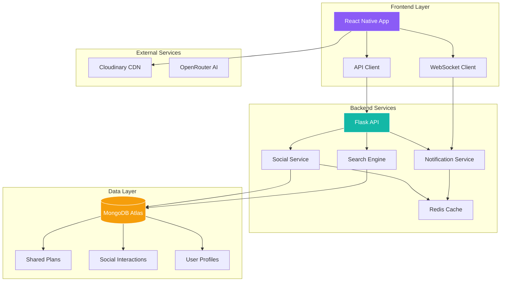
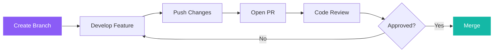

# 🚀 YiZ Planner Social Media Feature Implementation Guide

<div align="center">
  
  ### 🎯 Transform Your Learning Platform into a Thriving Community
  
  [](https://github.com)
  [](https://github.com)
  [](https://github.com)
  [](https://github.com)
  
</div>

---

## 👥 Team Collaboration Guide

<table>
<tr>
<td width="50%">

### 🔙 **Zayan - Backend Lead**
**Primary Focus**: API Development & Database Design

**Key Responsibilities**:
- MongoDB schema design & migrations
- Flask API endpoints & business logic
- Authentication & security implementation
- WebSocket server setup
- Performance optimization & caching

**Tools & Technologies**:
- Python 3.11 + Flask
- MongoDB with PyMongo
- Redis for caching
- WebSocket implementation
- JWT authentication

</td>
<td width="50%">

### 🎨 **Yifei - Frontend Lead**
**Primary Focus**: UI/UX & Mobile Development

**Key Responsibilities**:
- React Native component development
- Screen layouts & navigation
- Social interaction interfaces
- Real-time UI updates
- Mobile-first design patterns

**Tools & Technologies**:
- React Native + Expo SDK 53
- JavaScript (JSX)
- React Navigation
- WebSocket client
- Axios for API calls

</td>
</tr>
</table>

---

## 📋 Executive Summary

<table>
<tr>
<td width="50%">

### 🎨 **Vision**
Transform YiZ Planner into a collaborative learning ecosystem where users share, discover, and learn together through social features.

### 🏗️ **Architecture**
- **Frontend:** React Native + Expo
- **Backend:** Flask + MongoDB
- **Real-time:** WebSockets
- **Storage:** Cloudinary

</td>
<td width="50%">

### ✨ **Key Features**
- 📤 **Share** learning plans publicly
- 🔍 **Discover** community content  
- 💬 **Interact** with likes & comments
- 👥 **Collaborate** in learning groups
- 📊 **Track** social engagement

### 🎯 **Success Metrics**
- User engagement increase
- Community growth rate
- Content quality scores
- Collaboration frequency

</td>
</tr>
</table>

---

## 🏛️ System Architecture



---

## 💾 Database Design

### 📊 **Core Collections Overview**

<table>
<tr>
<th width="25%">Collection</th>
<th width="25%">Purpose</th>
<th width="50%">Key Fields</th>
</tr>
<tr>
<td>

**`shared_plans`** 📚

</td>
<td>Public learning content</td>
<td>

```javascript
{
  plan_type: "skill|habit",
  visibility: "public|private",
  likes_count: Number,
  rating: { average, count }
}
```

</td>
</tr>
<tr>
<td>

**`plan_interactions`** 👍

</td>
<td>User engagement tracking</td>
<td>

```javascript
{
  interaction_type: "like|download|rate",
  user_id: ObjectId,
  plan_id: ObjectId
}
```

</td>
</tr>
<tr>
<td>

**`plan_comments`** 💬

</td>
<td>Discussion threads</td>
<td>

```javascript
{
  content: String,
  parent_comment_id: ObjectId,
  likes_count: Number
}
```

</td>
</tr>
<tr>
<td>

**`plan_groups`** 👥

</td>
<td>Learning communities</td>
<td>

```javascript
{
  members: Array,
  settings: { is_public, max_members },
  member_count: Number
}
```

</td>
</tr>
</table>

### 🔍 **Indexing Strategy**

```javascript
// Performance-optimized indexes
db.shared_plans.createIndex({ 
  "title": "text", 
  "description": "text" 
});

db.shared_plans.createIndex({ 
  "category": 1, 
  "likes_count": -1 
});

db.plan_interactions.createIndex({ 
  "user_id": 1, 
  "plan_id": 1, 
  "interaction_type": 1 
}, { unique: true });
```

---

## 🔌 API Reference

### 🌟 **Social Endpoints**

<details>
<summary><b>📤 Plan Sharing APIs</b></summary>

#### **Share a Plan**
```http
POST /api/v1/social/plans/share
Authorization: Bearer {token}

{
  "plan_id": "507f1f77bcf86cd799439011",
  "plan_type": "skill",
  "description": "Master Python with hands-on projects",
  "tags": ["python", "programming", "projects"],
  "visibility": "public"
}
```

#### **Response**
```json
{
  "shared_plan_id": "607f1f77bcf86cd799439012",
  "url": "/social/plans/607f1f77bcf86cd799439012",
  "status": "published"
}
```

</details>

<details>
<summary><b>🔍 Discovery APIs</b></summary>

#### **Search Plans**
```http
GET /api/v1/social/search
Query params: q, category, difficulty, sort, page
```

#### **Trending Plans**
```http
GET /api/v1/social/trending
Query params: period (today|week|month), limit
```

#### **Categories**
```http
GET /api/v1/social/categories
```

</details>

<details>
<summary><b>💬 Interaction APIs</b></summary>

#### **Like/Unlike**
```http
POST /api/v1/social/plans/{id}/like
```

#### **Comment**
```http
POST /api/v1/social/plans/{id}/comments
{
  "content": "Great plan! Really helped me learn.",
  "parent_id": null
}
```

#### **Rate**
```http
POST /api/v1/social/plans/{id}/rate
{
  "rating": 5,
  "review": "Excellent curriculum structure!"
}
```

</details>

---

## 📱 Frontend Implementation

### 🎨 **Component Architecture**

```
src/
├── 📁 screens/social/
│   ├── 📄 BrowsePlansScreen.jsx      # Discovery hub
│   ├── 📄 SharedPlanDetailScreen.jsx  # Plan viewer
│   ├── 📄 UserProfileScreen.jsx       # Public profiles
│   └── 📄 GroupChatScreen.jsx         # Group collaboration
│
├── 📁 components/social/
│   ├── 🧩 SharedPlanCard.jsx         # Plan preview card
│   ├── 🧩 SocialActionBar.jsx        # Like/Share buttons
│   ├── 🧩 CommentThread.jsx          # Nested comments
│   ├── 🧩 RatingDisplay.jsx          # Star ratings
│   └── 🧩 UserCard.jsx               # User info card
│
└── 📁 hooks/social/
    ├── 🪝 useSocialPlans.js          # Plan data hook
    ├── 🪝 useComments.js             # Comments hook
    └── 🪝 useWebSocket.js            # Real-time updates
```

### 🖼️ **UI Components Gallery**

<table>
<tr>
<td width="50%">

#### **📇 SharedPlanCard**
```jsx
// Elegant plan preview with social metrics
<SharedPlanCard
  title="30-Day Python Mastery"
  author={{ name: "Sarah Chen", avatar: "..." }}
  stats={{
    likes: 234,
    downloads: 89,
    rating: 4.8
  }}
  tags={["python", "beginner"]}
  onPress={navigateToDetail}
/>
```

</td>
<td width="50%">

#### **⭐ RatingDisplay**
```jsx
// Interactive 5-star rating component
<RatingDisplay
  rating={4.5}
  count={156}
  size="medium"
  interactive={true}
  onRate={handleRating}
/>
```

</td>
</tr>
<tr>
<td width="50%">

#### **💬 CommentThread**
```jsx
// Nested comment system with reactions
<CommentThread
  planId={planId}
  onReply={handleReply}
  onLike={handleLike}
  maxDepth={3}
/>
```

</td>
<td width="50%">

#### **🔍 SearchFilters**
```jsx
// Advanced filtering UI
<SearchFilters
  categories={categories}
  onFilter={applyFilters}
  activeFilters={filters}
/>
```

</td>
</tr>
</table>

### 🎯 **Screen Designs**

#### **📱 BrowsePlansScreen**

```
┌─────────────────────────────────┐
│  🔍 Search Plans...             │
├─────────────────────────────────┤
│ [All] [Skills] [Habits] [★4.5+] │
├─────────────────────────────────┤
│ 🔥 Trending This Month          │
│ ┌─────────────┐ ┌─────────────┐ │
│ │   Python    │ │   Guitar    │ │
│ │   Mastery   │ │   Basics    │ │
│ │ ⭐ 4.8 (234)│ │ ⭐ 4.6 (189)│ │
│ └─────────────┘ └─────────────┘ │
│                                 │
│ 📚 Browse by Category           │
│ ┌─────┐ ┌─────┐ ┌─────┐       │
│ │ Tech │ │Music│ │ Art │ ...   │
│ └─────┘ └─────┘ └─────┘       │
└─────────────────────────────────┘
```

---

## 🔧 Implementation Roadmap

### 📍 **Phase 1: Foundation**
> *Building the core social infrastructure*

<table>
<tr>
<th width="50%">🔙 Backend Tasks</th>
<th width="50%">🎨 Frontend Tasks</th>
</tr>
<tr>
<td>

- [ ] Set up new MongoDB collections
- [ ] Create social service architecture
- [ ] Implement sharing endpoints
- [ ] Build search engine with filters
- [ ] Add caching layer with Redis

</td>
<td>

- [ ] Design BrowsePlansScreen UI
- [ ] Create SharedPlanCard component
- [ ] Implement search interface
- [ ] Build plan detail viewer
- [ ] Add loading states & animations

</td>
</tr>
</table>

### 📍 **Phase 2: Engagement**
> *Adding interactive social features*

<table>
<tr>
<th width="50%">🔙 Backend Tasks</th>
<th width="50%">🎨 Frontend Tasks</th>
</tr>
<tr>
<td>

- [ ] Like/unlike functionality
- [ ] Comment system with threading
- [ ] Rating & review system
- [ ] User profile endpoints
- [ ] Follow/follower logic

</td>
<td>

- [ ] Social interaction buttons
- [ ] Comment thread component
- [ ] Rating interface
- [ ] User profile screens
- [ ] Real-time update handling

</td>
</tr>
</table>

### 📍 **Phase 3: Community**
> *Enabling group collaboration*

<table>
<tr>
<th width="50%">🔙 Backend Tasks</th>
<th width="50%">🎨 Frontend Tasks</th>
</tr>
<tr>
<td>

- [ ] Group creation/management
- [ ] WebSocket server setup
- [ ] Group messaging system
- [ ] Notification service
- [ ] Content moderation

</td>
<td>

- [ ] Group screens & navigation
- [ ] WebSocket client integration
- [ ] Chat interface
- [ ] Push notifications
- [ ] Moderation UI

</td>
</tr>
</table>

---

## 🎯 Detailed Task Distribution & Workflow

### 📝 **Task Assignment Matrix**

<table>
<tr>
<th width="30%">Feature</th>
<th width="35%">🔙 Zayan Tasks</th>
<th width="35%">🎨 Yifei Tasks</th>
</tr>
<tr>
<td>

**🏗️ Foundation Setup**
*Week 1-2*

</td>
<td>

**Priority 1 (Critical)**
- [ ] Create MongoDB collections with proper schemas
- [ ] Set up Flask social service module
- [ ] Implement JWT middleware for social endpoints
- [ ] Create basic CRUD operations for shared plans
- [ ] Set up Redis caching infrastructure

**Files to Create:**
- `backend/services/social_service.py`
- `backend/repositories/social_repository.py`
- `backend/api/v1/social.py`
- `backend/models/social_models.py`

</td>
<td>

**Priority 1 (Critical)**
- [ ] Create social navigation structure
- [ ] Design SharedPlanCard component
- [ ] Set up BrowsePlansScreen scaffold
- [ ] Create social API client functions
- [ ] Implement basic loading states

**Files to Create:**
- `frontend/src/screens/social/BrowsePlansScreen.jsx`
- `frontend/src/components/social/SharedPlanCard.jsx`
- `frontend/src/api/social.js`
- `frontend/src/hooks/social/useSocialPlans.js`

</td>
</tr>
<tr>
<td>

**🔍 Discovery System**
*Week 3-4*

</td>
<td>

**Priority 2 (High)**
- [ ] Implement search endpoints with filters
- [ ] Create trending algorithm
- [ ] Add pagination for large datasets
- [ ] Implement category-based filtering
- [ ] Add search result caching

**API Endpoints:**
- `GET /api/v1/social/search`
- `GET /api/v1/social/trending`
- `GET /api/v1/social/categories`

</td>
<td>

**Priority 2 (High)**
- [ ] Build search interface with filters
- [ ] Create trending plans carousel
- [ ] Implement infinite scroll
- [ ] Add category selection UI
- [ ] Create search result animations

**Key Components:**
- `SearchFilters.jsx`
- `TrendingPlans.jsx`
- `CategorySelector.jsx`
- `PlanGrid.jsx`

</td>
</tr>
<tr>
<td>

**💬 Social Interactions**
*Week 5-6*

</td>
<td>

**Priority 3 (Medium)**
- [ ] Like/unlike functionality
- [ ] Comment system with threading
- [ ] Rating system implementation
- [ ] User interaction tracking
- [ ] Real-time notification triggers

**Database Collections:**
- `plan_interactions`
- `plan_comments`
- `user_notifications`

</td>
<td>

**Priority 3 (Medium)**
- [ ] Social action buttons
- [ ] Comment thread component
- [ ] Rating stars interface
- [ ] User interaction feedback
- [ ] Real-time update handling

**Interactive Components:**
- `SocialActionBar.jsx`
- `CommentThread.jsx`
- `RatingDisplay.jsx`
- `InteractionFeedback.jsx`

</td>
</tr>
</table>

### 🔄 **Daily Workflow**

#### **Morning Standup (15 minutes)**
- **Time**: 9:00 AM daily
- **Format**: Quick sync on Slack/Discord
- **Agenda**:
  - Yesterday's progress
  - Today's priorities
  - Any blockers or questions
  - Integration points needed

#### **Integration Points**
- **API-Frontend Integration**: Test endpoints as they're built
- **Schema Validation**: Ensure data structures match between backend and frontend
- **Error Handling**: Coordinate error response formats
- **Real-time Features**: Test WebSocket connections together

#### **End-of-Day Sync (10 minutes)**
- **Time**: 6:00 PM daily
- **Purpose**: 
  - Demo completed features
  - Plan next day's integration
  - Address any blockers
  - Update project status

### 🧪 **Testing & Quality Assurance**

#### **Individual Testing**
- **Zayan**: Unit tests for all API endpoints, database operations
- **Yifei**: Component tests, UI interaction tests, integration tests

#### **Joint Testing**
- **API Integration**: Test all endpoints with real frontend calls
- **User Flow Testing**: Complete user journeys from discovery to interaction
- **Performance Testing**: Load testing with realistic data volumes
- **Cross-platform Testing**: iOS, Android, and web compatibility

#### **Quality Gates**
- [ ] All API endpoints return proper error codes
- [ ] All UI components handle loading and error states
- [ ] Database queries are optimized and indexed
- [ ] Mobile responsiveness on all screen sizes
- [ ] Real-time features work reliably

---

## 🌿 Git Collaboration Strategy

### 🔀 **Branching Model**

```
🌳 main (production)
 └── 🌿 develop (integration)
      ├── 🍃 feature/social-foundation
      ├── 🍃 feature/social-discovery
      ├── 🍃 feature/social-interactions
      └── 🍃 feature/social-groups
```

### 📝 **Commit Convention**

| Type | Description | Example |
|------|-------------|---------|
| ✨ `feat` | New feature | `feat: add plan sharing endpoint` |
| 🐛 `fix` | Bug fix | `fix: correct like count update` |
| 💄 `style` | UI/UX changes | `style: improve card animations` |
| ♻️ `refactor` | Code restructure | `refactor: optimize search query` |
| 📝 `docs` | Documentation | `docs: update API examples` |
| ✅ `test` | Add tests | `test: add social API tests` |

### 🤝 **Pull Request Flow**



---

## 🔒 Security & Privacy

### 🛡️ **Security Layers**

<table>
<tr>
<td width="33%">

#### **🔐 Authentication**
- JWT token validation
- Permission-based access
- Session management
- Rate limiting

</td>
<td width="33%">

#### **🧹 Input Validation**
```python
@validate_schema(SharePlanSchema)
def share_plan(data):
    # Auto-validated input
    pass
```

</td>
<td width="33%">

#### **👮 Content Moderation**
- Automated filtering
- User reporting system
- Manual review queue
- Ban/block functionality

</td>
</tr>
</table>

### 🔏 **Privacy Controls**

```javascript
// User privacy settings
{
  profile_visibility: "public|private|followers",
  show_email: false,
  show_progress: true,
  allow_messages: "everyone|followers|none"
}
```

---

## ⚡ Performance Optimization

### 🚀 **Speed Enhancements**

<table>
<tr>
<th>Area</th>
<th>Optimization</th>
<th>Impact</th>
</tr>
<tr>
<td>🗄️ **Database**</td>
<td>

- Compound indexes
- Query optimization
- Connection pooling

</td>
<td>-70% query time</td>
</tr>
<tr>
<td>💾 **Caching**</td>
<td>

- Redis for hot data
- CDN for images
- Browser caching

</td>
<td>-80% load time</td>
</tr>
<tr>
<td>📱 **Frontend**</td>
<td>

- Lazy loading
- Image optimization
- Code splitting

</td>
<td>-60% bundle size</td>
</tr>
</table>

### 📊 **Monitoring Dashboard**

```
┌─────────────────────────────────────┐
│         Performance Metrics         │
├─────────────────────────────────────┤
│ API Response Time:    45ms    ✅   │
│ Cache Hit Rate:       92%     ✅   │
│ Active WebSockets:    1,234   📈   │
│ Error Rate:           0.02%   ✅   │
└─────────────────────────────────────┘
```

---

## 🧪 Testing Strategy

### 🎯 **Test Coverage Goals**

```
┌─────────────────────────────┐
│      Test Coverage          │
├─────────────────────────────┤
│ ████████████████████ 95%   │ Unit Tests
│ ██████████████████░░ 90%   │ Integration
│ ████████████████░░░░ 80%   │ E2E Tests
│ ██████████████░░░░░░ 70%   │ Performance
└─────────────────────────────┘
```

### 🔍 **Test Examples**

<details>
<summary><b>Backend Test Suite</b></summary>

```python
# test_social_features.py
class TestSocialFeatures:
    def test_share_plan_success(self):
        """Test successful plan sharing"""
        
    def test_privacy_controls(self):
        """Test visibility settings"""
        
    def test_search_functionality(self):
        """Test search with filters"""
        
    def test_rate_limiting(self):
        """Test API rate limits"""
```

</details>

<details>
<summary><b>Frontend Test Suite</b></summary>

```javascript
// BrowsePlansScreen.test.js
describe('BrowsePlansScreen', () => {
  test('displays trending plans');
  test('search debouncing works');
  test('filters update results');
  test('infinite scroll loads more');
});
```

</details>

---

## 🚀 Deployment Guide

### 📦 **Environment Setup**

```bash
# 🔙 Backend Environment Variables
MONGO_URI="mongodb+srv://..."
REDIS_URL="redis://..."
CLOUDINARY_URL="cloudinary://..."
JWT_SECRET_KEY="..."
WEBSOCKET_SECRET="..."

# 🎨 Frontend Environment Variables  
EXPO_PUBLIC_API_BASE_URL="https://api.yizplanner.com"
EXPO_PUBLIC_WS_URL="wss://ws.yizplanner.com"
EXPO_PUBLIC_CDN_URL="https://cdn.yizplanner.com"
```

### 🔄 **Migration Strategy**

```
┌──────────────┐     ┌──────────────┐     ┌──────────────┐
│   Backup     │────▶│    Deploy    │────▶│     Run      │
│    Data      │     │   Backend    │     │  Migrations  │
└──────────────┘     └──────────────┘     └──────────────┘
                                                   │
                                                   ▼
┌──────────────┐     ┌──────────────┐     ┌──────────────┐
│   Monitor    │◀────│    Enable    │◀────│   Deploy     │
│   Metrics    │     │   Features   │     │  Frontend    │
└──────────────┘     └──────────────┘     └──────────────┘
```

---

## 🛠️ Troubleshooting Guide

### 💡 **Common Issues & Solutions**

<details>
<summary><b>🐌 Slow Search Performance</b></summary>

**Symptoms:** Search takes >2 seconds  
**Solution:**
1. Check MongoDB text indexes
2. Implement result caching
3. Optimize query aggregations
4. Add search debouncing

</details>

<details>
<summary><b>🔌 WebSocket Connection Issues</b></summary>

**Symptoms:** Real-time updates not working  
**Solution:**
1. Verify WebSocket URL configuration
2. Check firewall/proxy settings
3. Implement reconnection logic
4. Add connection state indicators

</details>

<details>
<summary><b>📈 High Database Load</b></summary>

**Symptoms:** Slow queries, timeouts  
**Solution:**
1. Add read replicas
2. Optimize aggregation pipelines
3. Implement query result caching
4. Review and add missing indexes

</details>

---

## 📚 Resources & References

### 🔗 **Quick Links**

<table>
<tr>
<td width="50%">

**📖 Documentation**
- [MongoDB Aggregation Framework](https://docs.mongodb.com/manual/aggregation/)
- [React Native Performance](https://reactnative.dev/docs/performance)
- [Flask-SocketIO Guide](https://flask-socketio.readthedocs.io/)
- [Redis Best Practices](https://redis.io/docs/manual/patterns/)

</td>
<td width="50%">

**🛠️ Tools & Libraries**
- [Cloudinary SDK](https://cloudinary.com/documentation)
- [JWT Debugger](https://jwt.io/)
- [MongoDB Compass](https://www.mongodb.com/products/compass)
- [React DevTools](https://react.dev/learn/react-developer-tools)

</td>
</tr>
</table>

---

## 🤖 Working with AI Assistants (Claude/Cursor)

### 📋 **Essential Context to Provide**

When working with AI assistants like Claude Code or Cursor, always provide this context:

#### **Core Context Documents**
1. **This Document**: `newFeature.md` - Social feature specifications
2. **Developer Guide**: `Developer's Guide.md` - Existing system architecture  
3. **Current File**: The specific file you're working on

#### **Context Template for AI Conversations**
```
I'm working on implementing social media features for YiZ Planner. Here's the context:

Current System:
- React Native + Expo SDK 53 frontend
- Python Flask + MongoDB backend  
- JWT authentication already implemented
- Existing features: skills, habits, analytics

Task: [Specific task you're working on]
Role: [Zayan - Backend / Yifei - Frontend]

Please help me implement [specific feature] following the patterns in our existing codebase.

Files to consider:
- [List relevant existing files]
- [New files to create]
```

### 🎯 **AI Assistant Best Practices**

#### **For Zayan (Backend)**
```python
# Always mention these patterns when asking for help:
# 1. Flask app factory pattern (backend/app.py)
# 2. Repository pattern (backend/repositories/)
# 3. Service layer pattern (backend/services/)
# 4. JWT auth middleware (backend/auth/utils.py)
# 5. MongoDB ObjectId handling

# Example prompt:
"I need to create a social plan sharing endpoint following our existing patterns. 
We use Flask blueprints, repository pattern, and JWT authentication. 
Please help me implement POST /api/v1/social/plans/share"
```

#### **For Yifei (Frontend)**
```javascript
// Always mention these patterns when asking for help:
// 1. React Navigation structure (MainTabNavigator.jsx)
// 2. API client pattern (src/api/)
// 3. Custom hooks pattern (src/hooks/)
// 4. AuthContext usage (src/context/AuthContext.js)
// 5. Component styling patterns

// Example prompt:
"I need to create a BrowsePlansScreen following our existing patterns.
We use React Navigation, custom hooks for API calls, and consistent styling.
Please help me implement the social discovery screen."
```

### 🔄 **Integration Checkpoints**

#### **Backend-Frontend Integration**
- [ ] API endpoint created and tested
- [ ] Frontend API client function created
- [ ] Data flow tested end-to-end
- [ ] Error handling implemented on both sides
- [ ] Loading states handled in UI

#### **Database Integration**
- [ ] MongoDB collections created
- [ ] Indexes added for performance
- [ ] Sample data created for testing
- [ ] Validation schemas implemented
- [ ] Migration scripts written

---

## ✅ Master Implementation Checklist

### 🏗️ **Phase 1: Foundation (Weeks 1-2)**

#### **Backend Tasks - Zayan**
- [ ] **Database Setup**
  - [ ] Create `shared_plans` collection schema
  - [ ] Create `plan_interactions` collection schema  
  - [ ] Create `plan_comments` collection schema
  - [ ] Create `plan_groups` collection schema
  - [ ] Add proper indexes for performance

- [ ] **API Infrastructure**
  - [ ] Create social service module
  - [ ] Set up social repository layer
  - [ ] Create social API blueprint
  - [ ] Implement JWT middleware for social endpoints
  - [ ] Add input validation schemas

- [ ] **Core Endpoints**
  - [ ] `POST /api/v1/social/plans/share` - Share a plan
  - [ ] `GET /api/v1/social/plans` - Get shared plans
  - [ ] `GET /api/v1/social/plans/{id}` - Get specific shared plan
  - [ ] `DELETE /api/v1/social/plans/{id}` - Delete shared plan

#### **Frontend Tasks - Yifei**
- [ ] **Navigation Setup**
  - [ ] Add Social tab to MainTabNavigator
  - [ ] Create social screens navigation stack
  - [ ] Add social icons and styling

- [ ] **Base Components**
  - [ ] Create `BrowsePlansScreen` scaffold
  - [ ] Create `SharedPlanCard` component
  - [ ] Create `SocialActionBar` component
  - [ ] Add loading and error states

- [ ] **API Integration**
  - [ ] Create social API client (`src/api/social.js`)
  - [ ] Create `useSocialPlans` hook
  - [ ] Test API integration with backend

### 🔍 **Phase 2: Discovery (Weeks 3-4)**

#### **Backend Tasks - Zayan**
- [ ] **Search Implementation**
  - [ ] Create search endpoint with filters
  - [ ] Implement trending algorithm
  - [ ] Add category-based filtering
  - [ ] Add pagination support
  - [ ] Implement search result caching

- [ ] **Performance Optimization**
  - [ ] Add Redis caching layer
  - [ ] Optimize database queries
  - [ ] Add query result pagination
  - [ ] Implement rate limiting

#### **Frontend Tasks - Yifei**
- [ ] **Search Interface**
  - [ ] Create search bar component
  - [ ] Add filter options UI
  - [ ] Implement search debouncing
  - [ ] Add search history

- [ ] **Discovery Features**
  - [ ] Create trending plans carousel
  - [ ] Add category selection
  - [ ] Implement infinite scroll
  - [ ] Add search result animations

### 💬 **Phase 3: Interactions (Weeks 5-6)**

#### **Backend Tasks - Zayan**
- [ ] **Social Features**
  - [ ] Like/unlike functionality
  - [ ] Comment system with threading
  - [ ] Rating system implementation
  - [ ] User interaction tracking
  - [ ] Real-time notification triggers

- [ ] **Advanced Features**
  - [ ] WebSocket server setup
  - [ ] Notification system
  - [ ] Content moderation tools
  - [ ] Analytics tracking

#### **Frontend Tasks - Yifei**
- [ ] **Interactive Components**
  - [ ] Social action buttons
  - [ ] Comment thread component
  - [ ] Rating stars interface
  - [ ] User interaction feedback

- [ ] **Real-time Features**
  - [ ] WebSocket client integration
  - [ ] Real-time notifications
  - [ ] Live updates for likes/comments
  - [ ] Connection status indicators

### 🚀 **Phase 4: Polish & Deploy (Week 7)**

#### **Joint Tasks**
- [ ] **Testing & Quality**
  - [ ] End-to-end testing
  - [ ] Performance testing
  - [ ] Cross-platform testing
  - [ ] Security testing

- [ ] **Deployment**
  - [ ] Environment configuration
  - [ ] Database migrations
  - [ ] Production deployment
  - [ ] Monitoring setup

---

## 🎯 Success Metrics & Completion Criteria

### **Technical Metrics**
- [ ] All API endpoints respond < 500ms
- [ ] Database queries use proper indexes
- [ ] Frontend components handle all states (loading, error, empty)
- [ ] Mobile app works on iOS, Android, and web
- [ ] Real-time features work reliably
- [ ] Search results are relevant and fast

### **User Experience Metrics**
- [ ] Users can share plans in < 3 taps
- [ ] Discovery features help users find relevant content
- [ ] Social interactions feel responsive and natural
- [ ] UI follows existing design patterns
- [ ] Error messages are helpful and clear

### **Code Quality Metrics**
- [ ] Code follows existing patterns and conventions
- [ ] All functions have proper error handling
- [ ] Database operations are optimized
- [ ] Security best practices followed
- [ ] Documentation is comprehensive

---

<div align="center">

### 🎉 **Ready to Build Something Amazing!**

**Team YiZ**: Building the Future of Social Learning 🚀

Made with ❤️ for collaborative learning

---

**Quick Start**: 
1. Clone the repo and set up your development environment
2. Review the existing codebase in `Developer's Guide.md`
3. Pick your first task from the checklist above
4. Start building and collaborate daily!

</div>