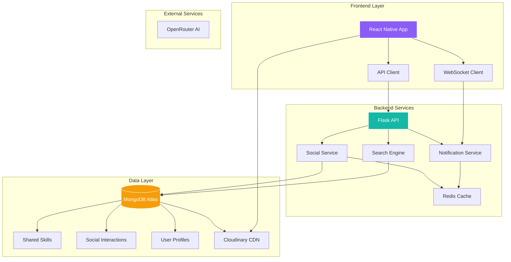
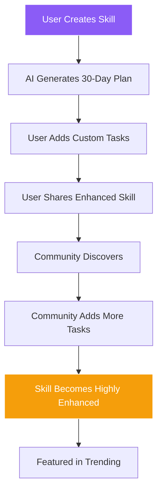
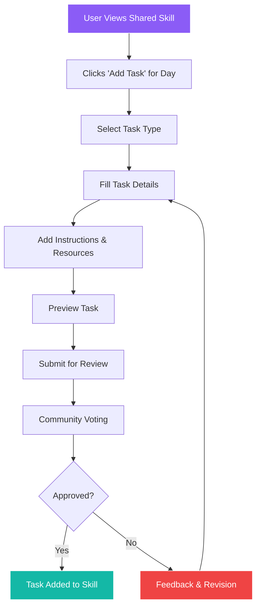
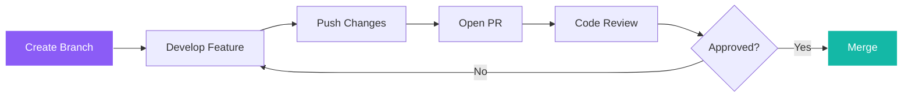

# 🚀 YiZ Planner Social Media Feature Implementation Guide

<div align="center">
  
  ### 🎯 Transform Your Learning Platform into a Thriving Community
  
  [](https://github.com)
  [](https://github.com)
  [](https://github.com)
  [](https://github.com)
  
</div>

---

## 👥 Team Collaboration Guide

<table>
<tr>
<td width="50%">

### 🔙 **Zayan - Backend Lead**
**Primary Focus**: API Development & Database Design

**Key Responsibilities**:
- MongoDB schema design & migrations
- Flask API endpoints & business logic
- Authentication & security implementation
- WebSocket server setup
- Performance optimization & caching

**Tools & Technologies**:
- Python 3.11 + Flask
- MongoDB with PyMongo
- Redis for caching
- WebSocket implementation
- JWT authentication

</td>
<td width="50%">

### 🎨 **Yifei - Frontend Lead**
**Primary Focus**: UI/UX & Mobile Development

**Key Responsibilities**:
- React Native component development
- Screen layouts & navigation
- Social interaction interfaces
- Real-time UI updates
- Mobile-first design patterns

**Tools & Technologies**:
- React Native + Expo SDK 53
- JavaScript (JSX)
- React Navigation
- WebSocket client
- Axios for API calls

</td>
</tr>
</table>

---

## 📋 Executive Summary

<table>
<tr>
<td width="50%">

### 🎨 **Vision**
Transform YiZ Planner into a collaborative learning ecosystem where users share, discover, and learn together through social features.

### 🏗️ **Architecture**
- **Frontend:** React Native + Expo
- **Backend:** Flask + MongoDB
- **Real-time:** WebSockets
- **Storage:** Cloudinary

</td>
<td width="50%">

### ✨ **Key Features**
- 📤 **Share** customized skill plans with the community
- 🔍 **Discover** community-improved learning content
- 💬 **Interact** with likes, comments & ratings
- 👥 **Collaborate** in learning groups
- 📊 **Track** social engagement & completion rates
- ✏️ **Customize** - Add your own tasks, instructions & resources to any day

### 🎯 **Success Metrics**
- User engagement increase
- Community growth rate
- Content quality scores
- Collaboration frequency

</td>
</tr>
</table>

---

## 🏛️ System Architecture



---

## 💾 Database Design

### 📊 **Core Collections Overview**

<table>
<tr>
<th width="25%">Collection</th>
<th width="25%">Purpose</th>
<th width="50%">Key Fields</th>
</tr>
<tr>
<td>

**`shared_skills`** 📚

</td>
<td>Community-shared learning plans</td>
<td>

```javascript
{
  original_skill_id: ObjectId,
  shared_by: ObjectId,
  title: String,
  description: String,
  curriculum: Array, // 30-day plan with custom tasks
  difficulty: "beginner|intermediate|advanced",
  category: String,
  tags: Array,
  likes_count: Number,
  downloads_count: Number,
  rating: { average, count },
  has_custom_tasks: Boolean
}
```

</td>
</tr>
<tr>
<td>

**`custom_tasks`** ✏️

</td>
<td>User-added custom tasks for specific days</td>
<td>

```javascript
{
  skill_id: ObjectId,
  day: Number,
  user_id: ObjectId,
  task: {
    title: String,
    description: String,
    instructions: String,
    resources: Array,
    estimated_time: Number,
    task_type: "reading|exercise|project|video"
  }
}
```

</td>
</tr>
<tr>
<td>

**`plan_interactions`** 👍

</td>
<td>User engagement tracking</td>
<td>

```javascript
{
  interaction_type: "like|download|rate",
  user_id: ObjectId,
  plan_id: ObjectId
}
```

</td>
</tr>
<tr>
<td>

**`plan_comments`** 💬

</td>
<td>Discussion threads</td>
<td>

```javascript
{
  content: String,
  parent_comment_id: ObjectId,
  likes_count: Number
}
```

</td>
</tr>
<tr>
<td>

**`plan_groups`** 👥

</td>
<td>Learning communities</td>
<td>

```javascript
{
  members: Array,
  settings: { is_public, max_members },
  member_count: Number
}
```

</td>
</tr>
</table>

### 🔍 **Indexing Strategy**

```javascript
// Performance-optimized indexes
db.shared_skills.createIndex({ 
  "title": "text", 
  "description": "text" 
});

db.shared_skills.createIndex({ 
  "category": 1, 
  "likes_count": -1 
});

db.plan_interactions.createIndex({ 
  "user_id": 1, 
  "plan_id": 1, 
  "interaction_type": 1 
}, { unique: true });

db.custom_tasks.createIndex({ 
  "skill_id": 1, 
  "day": 1, 
  "user_id": 1 
}, { unique: true });
```

---

## 🔌 API Reference

### 🌟 **Social Endpoints**

<details>
<summary><b>📤 Plan Sharing APIs</b></summary>

#### **Share a Skill**
```http
POST /api/v1/social/skills/share
Authorization: Bearer {token}

{
  "skill_id": "507f1f77bcf86cd799439011",
  "description": "Master Python with hands-on projects",
  "tags": ["python", "programming", "projects"],
  "visibility": "public",
  "include_custom_tasks": true
}
```

#### **Add Custom Task to Day**
```http
POST /api/v1/social/skills/{id}/days/{day}/tasks
Authorization: Bearer {token}

{
  "title": "Build a Calculator App",
  "description": "Create a functional calculator using Python",
  "instructions": "1. Design the UI layout\n2. Implement basic operations\n3. Add error handling",
  "resources": [
    "https://docs.python.org/3/library/tkinter.html",
    "https://realpython.com/python-gui-tkinter/"
  ],
  "estimated_time": 120,
  "task_type": "project"
}
```

#### **Response**
```json
{
  "shared_skill_id": "607f1f77bcf86cd799439012",
  "url": "/social/skills/607f1f77bcf86cd799439012",
  "status": "published",
  "has_custom_tasks": true
}
```

</details>

<details>
<summary><b>🔍 Discovery APIs</b></summary>

#### **Search Skills**
```http
GET /api/v1/social/search
Query params: q, category, difficulty, sort, page, has_custom_tasks
# sort: "popularity|rating|recent|downloads"
# has_custom_tasks: "true|false|all"
```

#### **Trending Skills**
```http
GET /api/v1/social/trending
Query params: period (today|week|month), limit
```

#### **Get Skill Custom Tasks**
```http
GET /api/v1/social/skills/{id}/custom-tasks
Query params: day (optional)
```

#### **Categories**
```http
GET /api/v1/social/categories
```

</details>

<details>
<summary><b>💬 Interaction APIs</b></summary>

#### **Like/Unlike**
```http
POST /api/v1/social/plans/{id}/like
```

#### **Comment**
```http
POST /api/v1/social/plans/{id}/comments
{
  "content": "Great plan! Really helped me learn.",
  "parent_id": null
}
```

#### **Rate**
```http
POST /api/v1/social/plans/{id}/rate
{
  "rating": 5,
  "review": "Excellent curriculum structure!"
}
```

</details>

---

## 📱 Frontend Implementation

### 🎨 **Component Architecture**

```
src/
├── 📁 screens/social/
│   ├── 📄 BrowseSkillsScreen.jsx       # Discovery hub
│   ├── 📄 SharedSkillDetailScreen.jsx  # Shared skill viewer
│   ├── 📄 CustomTaskEditorScreen.jsx   # Custom task creation
│   ├── 📄 UserProfileScreen.jsx        # User profiles
│   └── 📄 GroupChatScreen.jsx          # Group collaboration
│
├── 📁 components/social/
│   ├── 🧩 SkillCard.jsx               # Community skill card
│   ├── 🧩 CustomTaskCard.jsx          # User-added task card
│   ├── 🧩 TaskEditor.jsx              # Inline task editing
│   ├── 🧩 SocialActionBar.jsx         # Like/Share buttons
│   ├── 🧩 CommentThread.jsx           # Nested comments
│   ├── 🧩 RatingDisplay.jsx           # Star ratings
│   ├── 🧩 CustomTaskBadge.jsx         # Custom content indicator
│   └── 🧩 ResourceList.jsx            # Task resources display
│
└── 📁 hooks/social/
    ├── 🪝 useSocialSkills.js          # Skill data hook
    ├── 🪝 useCustomTasks.js           # Custom task management
    ├── 🪝 useComments.js              # Comments hook
    └── 🪝 useWebSocket.js             # Real-time updates
```

### 🖼️ **UI Components Gallery**

<table>
<tr>
<td width="50%">

#### **📚 SkillCard**
```jsx
// Community-shared skill with customization info
<SkillCard
  title="30-Day Python Mastery"
  author={{ name: "Sarah Chen", avatar: "..." }}
  badge={hasCustomTasks ? "Enhanced" : "Standard"}
  stats={{
    likes: 234,
    downloads: 89,
    rating: 4.2,
    customTasks: 12
  }}
  tags={["python", "beginner"]}
  hasCustomTasks={true}
  onPress={navigateToDetail}
/>
```

#### **✏️ CustomTaskCard**
```jsx
// User-added custom task
<CustomTaskCard
  title="Build a Calculator App"
  description="Create a functional calculator using Python"
  taskType="project"
  estimatedTime={120}
  resources={[
    "https://docs.python.org/3/library/tkinter.html",
    "https://realpython.com/python-gui-tkinter/"
  ]}
  addedBy="community"
  onEdit={handleEdit}
/>
```

</td>
<td width="50%">

#### **⭐ RatingDisplay**
```jsx
// Interactive 5-star rating component
<RatingDisplay
  rating={4.5}
  count={156}
  size="medium"
  interactive={true}
  onRate={handleRating}
/>
```

</td>
</tr>
<tr>
<td width="50%">

#### **💬 CommentThread**
```jsx
// Nested comment system with reactions
<CommentThread
  planId={planId}
  onReply={handleReply}
  onLike={handleLike}
  maxDepth={3}
/>
```

</td>
<td width="50%">

#### **🔍 SearchFilters**
```jsx
// Advanced filtering UI
<SearchFilters
  categories={categories}
  onFilter={applyFilters}
  activeFilters={filters}
/>
```

</td>
</tr>
</table>

### 🎯 **Screen Designs**

#### **📱 BrowseSkillsScreen**

```
┌─────────────────────────────────┐
│  🔍 Search Skills...            │
├─────────────────────────────────┤
│ [All] [📚Standard] [✏️Enhanced] │
│ [Beginner] [★4.5+] [Most Custom]│
├─────────────────────────────────┤
│ 🔥 Trending This Month          │
│ ┌─────────────┐ ┌─────────────┐ │
│ │📚 Python    │ │✏️ Web Dev   │ │
│ │  Basics     │ │  Mastery    │ │
│ │⭐4.2 (234)  │ │⭐4.8 (456)  │ │
│ │Standard Plan│ │+12 Custom   │ │
│ └─────────────┘ └─────────────┘ │
│                                 │
│ 📚 Browse by Category           │
│ ┌─────┐ ┌─────┐ ┌─────┐       │
│ │ Tech │ │Music│ │ Art │ ...   │
│ └─────┘ └─────┘ └─────┘       │
│                                 │
│ 🏆 Top Contributors This Week   │
│ ┌─────────────┐ ┌─────────────┐ │
│ │Sarah Chen   │ │Alex Rodriguez│ │
│ │+23 tasks    │ │+18 tasks     │ │
│ └─────────────┘ └─────────────┘ │
└─────────────────────────────────┘
```

---

## 🔧 Implementation Roadmap

### 📍 **Phase 1: Foundation**
> *Building the core social infrastructure*

<table>
<tr>
<th width="50%">🔙 Backend Tasks</th>
<th width="50%">🎨 Frontend Tasks</th>
</tr>
<tr>
<td>

- [ ] Set up new MongoDB collections
- [ ] Create social service architecture
- [ ] Implement sharing endpoints
- [ ] Build search engine with filters
- [ ] Add caching layer with Redis

</td>
<td>

- [ ] Design BrowseSkillsScreen UI
- [ ] Create SharedSkillCard component
- [ ] Implement search interface
- [ ] Build skill detail viewer with custom tasks
- [ ] Add loading states & animations

</td>
</tr>
</table>

### 📍 **Phase 2: Engagement**
> *Adding interactive social features*

<table>
<tr>
<th width="50%">🔙 Backend Tasks</th>
<th width="50%">🎨 Frontend Tasks</th>
</tr>
<tr>
<td>

- [ ] Like/unlike functionality
- [ ] Comment system with threading
- [ ] Rating & review system
- [ ] User profile endpoints
- [ ] Follow/follower logic

</td>
<td>

- [ ] Social interaction buttons
- [ ] Comment thread component
- [ ] Rating interface
- [ ] User profile screens
- [ ] Real-time update handling

</td>
</tr>
</table>

### 📍 **Phase 3: Community**
> *Enabling group collaboration*

<table>
<tr>
<th width="50%">🔙 Backend Tasks</th>
<th width="50%">🎨 Frontend Tasks</th>
</tr>
<tr>
<td>

- [ ] Group creation/management
- [ ] WebSocket server setup
- [ ] Group messaging system
- [ ] Notification service
- [ ] Content moderation

</td>
<td>

- [ ] Group screens & navigation
- [ ] WebSocket client integration
- [ ] Chat interface
- [ ] Push notifications
- [ ] Moderation UI

</td>
</tr>
</table>

---

## 🎯 Skill Customization & Enhancement Strategy

### 🛠️ **Skill Plan Flexibility**

<table>
<tr>
<th width="50%">📚 **Standard Skills**</th>
<th width="50%">✏️ **Enhanced Skills**</th>
</tr>
<tr>
<td>

**🎯 Purpose**: AI-generated baseline learning paths
**👤 Creator**: AI + Original user
**💰 Price**: Always free
**⏱️ Duration**: 30 days (standard)
**🎨 UI Badge**: "Standard" (Blue)

**Key Features**:
- AI-generated daily tasks
- Basic resources and instructions
- Community feedback and ratings
- Download and share easily
- Perfect starting point for learning

**Success Metrics**:
- Likes and downloads
- Community ratings
- Completion rates
- Share frequency

</td>
<td>

**🎯 Purpose**: Community-improved learning curricula
**👤 Creator**: Community contributors
**💰 Price**: Always free
**⏱️ Duration**: 30+ days (flexible)
**🎨 UI Badge**: "Enhanced" (Gold)

**Key Features**:
- User-added custom tasks
- Detailed instructions and resources
- Rich multimedia content
- Step-by-step guidance
- Community-refined quality

**Success Metrics**:
- Custom task count
- User engagement depth
- Community contributions
- Learning outcomes

</td>
</tr>
</table>

### 🔄 **Skill Enhancement Pipeline**



### 🎨 **Task Customization Features**

#### **Custom Task Types**
```javascript
const taskTypes = {
  reading: {
    icon: "📖",
    description: "Articles, tutorials, documentation",
    fields: ["title", "description", "resources", "estimated_time"]
  },
  exercise: {
    icon: "💪",
    description: "Hands-on practice and drills",
    fields: ["title", "instructions", "validation_criteria", "estimated_time"]
  },
  project: {
    icon: "🛠️",
    description: "Build something practical",
    fields: ["title", "description", "requirements", "deliverables", "resources"]
  },
  video: {
    icon: "🎥",
    description: "Video tutorials and courses",
    fields: ["title", "video_url", "duration", "key_points"]
  },
  quiz: {
    icon: "🧠",
    description: "Knowledge assessment",
    fields: ["title", "questions", "answers", "explanation"]
  }
};
```

#### **Enhanced Task Structure**
```javascript
{
  task_id: ObjectId,
  skill_id: ObjectId,
  day: 15,
  added_by: ObjectId,
  task: {
    title: "Build a Weather App",
    description: "Create a weather app using Python and API integration",
    task_type: "project",
    estimated_time: 180, // minutes
    
    // Detailed instructions
    instructions: `
      1. Set up project structure
      2. Get API key from OpenWeatherMap
      3. Create main application file
      4. Implement weather data fetching
      5. Add error handling
      6. Create user interface
      7. Test with different cities
    `,
    
    // Learning resources
    resources: [
      {
        type: "documentation",
        title: "OpenWeatherMap API Docs",
        url: "https://openweathermap.org/api",
        description: "Official API documentation"
      },
      {
        type: "tutorial",
        title: "Python Requests Tutorial",
        url: "https://realpython.com/python-requests/",
        description: "Learn to make HTTP requests"
      },
      {
        type: "video",
        title: "Building Weather Apps",
        url: "https://youtube.com/watch?v=...",
        duration: "45 minutes"
      }
    ],
    
    // Success criteria
    validation_criteria: [
      "App fetches current weather data",
      "Handles invalid city names gracefully",
      "Displays temperature, humidity, and conditions",
      "Code is well-commented and structured"
    ],
    
    // Community features
    likes_count: 23,
    usage_count: 156,
    difficulty_rating: 3.5,
    
    // Metadata
    created_at: ISODate,
    updated_at: ISODate
  }
}
```

### 🔍 **Discovery & Filtering Strategy**

#### **Enhanced Search Options**
```javascript
// Frontend filter options
const skillFilters = {
  enhancement: ['all', 'standard', 'enhanced'],
  difficulty: ['beginner', 'intermediate', 'advanced'],
  rating: ['4.5+', '4.0+', '3.5+'],
  customTasks: ['any', '5+', '10+', '20+'],
  taskTypes: ['reading', 'exercise', 'project', 'video', 'quiz'],
  duration: ['30-days', '30-45-days', '45+ days'],
  category: ['programming', 'languages', 'music', 'art', 'fitness']
};
```

#### **Smart Skill Ranking**
```python
def calculate_skill_score(skill, query, user_preferences):
    base_score = text_similarity(skill.title + skill.description, query)
    
    # Boost enhanced skills
    if skill.has_custom_tasks:
        custom_task_boost = min(skill.custom_tasks_count / 10, 1.0)
        base_score *= (1 + custom_task_boost * 0.4)
    
    # Community engagement boost
    engagement_score = (skill.likes_count + skill.downloads_count) / 1000
    base_score *= (1 + engagement_score * 0.3)
    
    # Quality indicators
    if skill.rating.average >= 4.5:
        base_score *= 1.2
    
    return base_score
```

---

## 🎯 Detailed Task Distribution & Workflow

### 📝 **Feature-Based Task Assignment & Git Workflow**

<table>
<tr>
<th width="50%">🔍 **Zayan - Search & Discovery Feature**</th>
<th width="50%">✏️ **Yifei - Skill Customization Feature**</th>
</tr>
<tr>
<td>

## **🚀 Day 1-2: Search Foundation**

### **📋 Tasks:**
- [ ] **Backend**: 
  - Create MongoDB text search indexes (see *Indexing Strategy* section)
  - Implement search aggregation pipelines using `$text` and `$search`
  - Build Flask search endpoints with filtering capabilities
  - Add Redis caching for search results (30s TTL)
  - Follow existing Flask patterns from `backend/repositories/`

- [ ] **Frontend**: 
  - Design BrowseSkillsScreen layout (see *Screen Designs* section)
  - Create SearchBar component with 300ms debouncing
  - Build SearchFilters component with category/difficulty options
  - Follow existing React Native patterns from `frontend/src/components/`

- [ ] **Integration**: 
  - Connect search API to frontend using existing `src/api/` patterns
  - Implement search result display with pagination (10 items per page)
  - Add loading states and error handling following existing patterns

### **🌿 Git Commands:**

**Before Starting:**
```bash
# Pull latest changes
git checkout develop
git pull origin develop

# Create feature branch
git checkout -b feature/search-discovery
```

**During Development:**
```bash
# Daily commits
git add .
git commit -m "feat(search): add search API endpoints"
git push origin feature/search-discovery
```

**After Completion:**
```bash
# Final commit and PR
git add .
git commit -m "feat(search): complete search foundation"
git push origin feature/search-discovery

# Create PR
gh pr create --title "Feature: Search & Discovery Foundation" --body "Complete search functionality with backend APIs and frontend UI"
```

---

## **🔥 Day 3-4: Advanced Discovery**

### **📋 Tasks:**
- [ ] **Backend**: 
  - Implement trending algorithm with time windows (see *Smart Skill Ranking* section)
  - Create category-based filtering system with popularity scoring
  - Build analytics tracking for search behavior and user engagement
  - Add Redis caching for trending content (15min TTL)
  - Follow existing service patterns from `backend/services/`

- [ ] **Frontend**: 
  - Create TrendingSkills carousel component with horizontal scrolling
  - Build CategorySelector interface with visual category icons
  - Implement infinite scroll for search results using FlatList
  - Add PopularSkills showcase section
  - Follow existing component patterns and styling

- [ ] **Integration**: 
  - Connect trending API to frontend carousel component
  - Implement category filtering with real-time search updates
  - Add performance optimization with React.memo and useMemo

### **🌿 Git Commands:**

**Before Starting:**
```bash
# Continue on same branch or create new
git checkout feature/search-discovery
git pull origin develop
git merge develop  # merge latest changes
```

**After Completion:**
```bash
git add .
git commit -m "feat(search): complete advanced discovery features"
git push origin feature/search-discovery

# Update PR or create new one
gh pr create --title "Feature: Advanced Search & Discovery" --body "Complete trending, categories, and advanced search features"
```

</td>
<td>

## **🚀 Day 1-2: Custom Task System**

### **📋 Tasks:**
- [ ] **Backend**: 
  - Create `custom_tasks` collection schema (see *Database Design* section)
  - Implement task CRUD operations with proper validation
  - Build task validation system for 5 task types (see *Custom Task Types*)
  - Add task versioning and history tracking
  - Follow existing repository patterns from `backend/repositories/`

- [ ] **Frontend**: 
  - Design CustomTaskEditor with rich text input capabilities
  - Create TaskTypeSelector with 5 task types (reading, exercise, project, video, quiz)
  - Build ResourceManager for adding links, videos, documents
  - Implement task preview functionality with real-time updates
  - Follow existing form patterns and component structure

- [ ] **Integration**: 
  - Connect task creation APIs to frontend editor
  - Implement task creation workflow with validation feedback
  - Add task preview that shows exactly how learners will see it

### **🌿 Git Commands:**

**Before Starting:**
```bash
# Pull latest changes
git checkout develop
git pull origin develop

# Create feature branch
git checkout -b feature/skill-customization
```

**During Development:**
```bash
# Daily commits
git add .
git commit -m "feat(tasks): add custom task creation API"
git push origin feature/skill-customization
```

**After Completion:**
```bash
# Final commit and PR
git add .
git commit -m "feat(tasks): complete custom task system"
git push origin feature/skill-customization

# Create PR
gh pr create --title "Feature: Custom Task System" --body "Complete custom task creation with backend APIs and frontend editor"
```

---

## **🏆 Day 3-4: Community Features**

### **📋 Tasks:**
- [ ] **Backend**: 
  - Implement task voting system with upvote/downvote functionality
  - Create contributor tier system (see *Contributor Recognition* section)
  - Build community moderation tools with reporting system
  - Add reputation scoring based on task quality and community feedback
  - Follow existing service patterns for user management

- [ ] **Frontend**: 
  - Create TaskVoting component with upvote/downvote buttons
  - Build ContributorProfile interface showing user achievements
  - Implement task quality indicators (rating stars, vote counts)
  - Add community guidelines UI and reporting interface
  - Follow existing user profile patterns and styling

- [ ] **Integration**: 
  - Connect voting APIs to frontend voting components
  - Implement contributor recognition with real-time badge updates
  - Add task approval workflow with community voting integration

### **🌿 Git Commands:**

**Before Starting:**
```bash
# Continue on same branch or create new
git checkout feature/skill-customization
git pull origin develop
git merge develop  # merge latest changes
```

**After Completion:**
```bash
git add .
git commit -m "feat(community): complete voting and contributor system"
git push origin feature/skill-customization

# Update PR or create new one
gh pr create --title "Feature: Community & Voting System" --body "Complete community features with voting, contributor recognition, and moderation"
```

</td>
</tr>
</table>

### 🤝 **Shared Integration (Day 5-7)**

<table>
<tr>
<th width="100%" colspan="2">**Both Team Members - Cross-Feature Integration**</th>
</tr>
<tr>
<td colspan="2">

## **🔗 Week 5-6: Feature Integration**

### **📋 Integration Tasks (Both):**
- [ ] **Cross-Feature Data Flow**: 
  - Ensure search results include custom task count and quality indicators
  - Make custom tasks appear in skill detail views with proper attribution
  - Update trending algorithm to consider custom task popularity
  - Add customization metrics to category filtering

- [ ] **Shared Social Features**: 
  - Implement like/comment/rating system that works across both features
  - Create unified user profiles showing both search and customization activities
  - Add real-time notifications for votes, comments, and skill interactions
  - Build social sharing capabilities for enhanced skills

- [ ] **Technical Integration**: 
  - Ensure data consistency between search and customization features
  - Implement shared authentication and authorization patterns
  - Create unified error handling and validation across features
  - Add performance optimization with shared caching strategies

### **🌿 Git Commands (Both):**

**Before Starting Integration:**
```bash
# Create integration branch
git checkout develop
git pull origin develop
git checkout -b feature/integration

# Merge both feature branches
git merge feature/search-discovery
git merge feature/skill-customization
```

**During Integration:**
```bash
# Daily commits for integration work
git add .
git commit -m "integrate: connect search with custom tasks"
git push origin feature/integration
```

**After Integration:**
```bash
# Final integration commit
git add .
git commit -m "integrate: complete cross-feature integration"
git push origin feature/integration

# Create integration PR
gh pr create --title "Integration: Search + Customization Features" --body "Complete integration of search discovery and skill customization features"
```

## **🚀 Day 7: Final Launch**

### **📋 Launch Tasks (Both):**
- [ ] **End-to-End Testing**: 
  - Test complete user journeys from skill discovery to task customization
  - Verify cross-feature integration works seamlessly
  - Perform load testing with realistic user data volumes
  - Test mobile responsiveness on iOS, Android, and web platforms

- [ ] **Production Preparation**: 
  - Set up production environment with proper scaling
  - Run database migrations and seed initial data
  - Create comprehensive API documentation for future development
  - Write user guides and tutorials for new features
  - Set up monitoring and analytics for feature usage tracking

- [ ] **Security & Performance**: 
  - Conduct security testing and vulnerability assessment
  - Optimize database queries and add proper indexing
  - Implement rate limiting and abuse prevention
  - Add comprehensive error logging and monitoring

### **🌿 Git Commands (Both):**

**Before Launch:**
```bash
# Final testing branch
git checkout develop
git pull origin develop
git checkout -b release/social-features
```

**Launch Preparation:**
```bash
# Final commits with testing and documentation
git add .
git commit -m "release: prepare social features for production"
git push origin release/social-features

# Create release PR to main
gh pr create --title "Release: Social Features v1.0" --body "Complete social features ready for production deployment"
```

</td>
</tr>
</table>

### 🔄 **Daily Workflow**

#### **Morning Standup (15 minutes)**
- **Time**: 9:00 AM daily
- **Format**: Quick sync on Slack/Discord
- **Agenda**:
  - Yesterday's progress
  - Today's priorities
  - Any blockers or questions
  - Integration points needed

#### **Integration Points**
- **API-Frontend Integration**: Test endpoints as they're built
- **Schema Validation**: Ensure data structures match between backend and frontend
- **Error Handling**: Coordinate error response formats
- **Real-time Features**: Test WebSocket connections together

#### **End-of-Day Sync (10 minutes)**
- **Time**: 6:00 PM daily
- **Purpose**: 
  - Demo completed features
  - Plan next day's integration
  - Address any blockers
  - Update project status

### 🧪 **Testing & Quality Assurance**

#### **Individual Testing**
- **Zayan**: Unit tests for all API endpoints, database operations
- **Yifei**: Component tests, UI interaction tests, integration tests

#### **Joint Testing**
- **API Integration**: Test all endpoints with real frontend calls
- **User Flow Testing**: Complete user journeys from discovery to interaction
- **Performance Testing**: Load testing with realistic data volumes
- **Cross-platform Testing**: iOS, Android, and web compatibility

#### **Quality Gates**
- [ ] All API endpoints return proper error codes
- [ ] All UI components handle loading and error states
- [ ] Database queries are optimized and indexed
- [ ] Mobile responsiveness on all screen sizes
- [ ] Real-time features work reliably

---

## 🛠️ Custom Task Creation & Management

### 🎯 **Task Enhancement Workflow**

#### **Adding Custom Tasks**


#### **Task Management Features**
- [ ] **Task Editor**: Rich text editor for instructions and descriptions
- [ ] **Resource Manager**: Add links, videos, documents, and images
- [ ] **Preview Mode**: See how learners will experience the task
- [ ] **Community Voting**: Upvote/downvote system for task quality
- [ ] **Version History**: Track changes and improvements over time

### 🔧 **Task Enhancement APIs**

#### **Custom Task Creation**
```http
# Add custom task to specific day
POST /api/v1/social/skills/{skill_id}/days/{day}/tasks
Authorization: Bearer {token}

{
  "title": "Build a Personal Portfolio Website",
  "description": "Create a responsive portfolio website to showcase your Python projects",
  "task_type": "project",
  "estimated_time": 240,
  "difficulty": "intermediate",
  "instructions": "1. Choose a web framework (Flask/Django)\n2. Design the layout\n3. Add project showcase\n4. Implement contact form\n5. Deploy to Heroku",
  "resources": [
    {
      "type": "tutorial",
      "title": "Flask Web Development",
      "url": "https://flask.palletsprojects.com/tutorial/",
      "description": "Official Flask tutorial"
    },
    {
      "type": "video",
      "title": "Building Portfolio with Flask",
      "url": "https://youtube.com/watch?v=...",
      "duration": "30 minutes"
    }
  ],
  "validation_criteria": [
    "Website is responsive on mobile and desktop",
    "Includes at least 3 Python projects",
    "Has working contact form",
    "Deployed and accessible online"
  ]
}
```

#### **Task Voting & Feedback**
```http
# Vote on custom task
POST /api/v1/social/tasks/{task_id}/vote
Authorization: Bearer {token}

{
  "vote": "up|down",
  "feedback": "Great task! Really helped me understand Flask better."
}
```

#### **Task Analytics**
```http
# Get task performance metrics
GET /api/v1/social/tasks/{task_id}/analytics
Authorization: Bearer {token}

Response:
{
  "task_id": "...",
  "usage_count": 156,
  "completion_rate": 78,
  "average_rating": 4.6,
  "votes": {
    "up": 89,
    "down": 12
  },
  "feedback_summary": {
    "positive": 85,
    "negative": 8,
    "neutral": 23
  },
  "time_metrics": {
    "avg_completion_time": 185,
    "estimated_time": 240
  }
}
```

### 🏆 **Community Contribution System**

#### **Contributor Recognition**
```
🥉 Contributor (Starting)
├── 1-5 custom tasks added
├── 4.0+ average task rating
├── 70%+ task approval rate
└── Basic contributor badge

🥈 Skilled Contributor (Active)
├── 6-15 custom tasks added
├── 4.5+ average task rating
├── 80%+ task approval rate
├── Featured in "Top Contributors"
└── Advanced task creation tools

🥇 Expert Contributor (Master)
├── 16+ custom tasks added
├── 4.8+ average task rating
├── 90%+ task approval rate
├── Moderation privileges
├── Featured profile
└── Early access to new features
```

### 📱 **Frontend Task Management**

#### **Task Enhancement Components**
```jsx
// Task editor for custom tasks
<TaskEditor
  taskType="project"
  onSave={handleSave}
  onPreview={handlePreview}
  initialData={taskData}
/>

// Task voting interface
<TaskVoting
  taskId={taskId}
  currentVote={userVote}
  upvotes={89}
  downvotes={12}
  onVote={handleVote}
/>

// Custom task display
<CustomTaskDisplay
  task={customTask}
  showContributor={true}
  showVoting={true}
  onEdit={handleEdit}
/>
```

#### **Enhanced User Experience**
- **Inline Editing**: Edit tasks directly in the skill view
- **Real-time Preview**: See changes as you type
- **Collaborative Editing**: Multiple users can suggest improvements
- **Smart Suggestions**: AI-powered resource recommendations
- **Progress Tracking**: See which custom tasks users complete most

---

## 🌿 Git Collaboration Strategy

### 🔀 **Branching Model**

```
🌳 main (production)
 └── 🌿 develop (integration)
      ├── 🍃 feature/social-foundation
      ├── 🍃 feature/social-discovery
      ├── 🍃 feature/social-interactions
      └── 🍃 feature/social-groups
```

### 📝 **Commit Convention**

| Type | Description | Example |
|------|-------------|---------|
| ✨ `feat` | New feature | `feat: add plan sharing endpoint` |
| 🐛 `fix` | Bug fix | `fix: correct like count update` |
| 💄 `style` | UI/UX changes | `style: improve card animations` |
| ♻️ `refactor` | Code restructure | `refactor: optimize search query` |
| 📝 `docs` | Documentation | `docs: update API examples` |
| ✅ `test` | Add tests | `test: add social API tests` |

### 🤝 **Pull Request Flow**



---

## 🔒 Security & Privacy

### 🛡️ **Security Layers**

<table>
<tr>
<td width="33%">

#### **🔐 Authentication**
- JWT token validation
- Permission-based access
- Session management
- Rate limiting

</td>
<td width="33%">

#### **🧹 Input Validation**
```python
@validate_schema(SharePlanSchema)
def share_plan(data):
    # Auto-validated input
    pass
```

</td>
<td width="33%">

#### **👮 Content Moderation**
- Automated filtering
- User reporting system
- Manual review queue
- Ban/block functionality

</td>
</tr>
</table>

### 🔏 **Privacy Controls**

```javascript
// User privacy settings
{
  profile_visibility: "public|private|followers",
  show_email: false,
  show_progress: true,
  allow_messages: "everyone|followers|none"
}
```

---

## ⚡ Performance Optimization

### 🚀 **Speed Enhancements**

<table>
<tr>
<th>Area</th>
<th>Optimization</th>
<th>Impact</th>
</tr>
<tr>
<td>🗄️ **Database**</td>
<td>

- Compound indexes
- Query optimization
- Connection pooling

</td>
<td>-70% query time</td>
</tr>
<tr>
<td>💾 **Caching**</td>
<td>

- Redis for hot data
- CDN for images
- Browser caching

</td>
<td>-80% load time</td>
</tr>
<tr>
<td>📱 **Frontend**</td>
<td>

- Lazy loading
- Image optimization
- Code splitting

</td>
<td>-60% bundle size</td>
</tr>
</table>

### 📊 **Monitoring Dashboard**

```
┌─────────────────────────────────────┐
│         Performance Metrics         │
├─────────────────────────────────────┤
│ API Response Time:    45ms    ✅   │
│ Cache Hit Rate:       92%     ✅   │
│ Active WebSockets:    1,234   📈   │
│ Error Rate:           0.02%   ✅   │
└─────────────────────────────────────┘
```

---

## 🧪 Testing Strategy

### 🎯 **Test Coverage Goals**

```
┌─────────────────────────────┐
│      Test Coverage          │
├─────────────────────────────┤
│ ████████████████████ 95%   │ Unit Tests
│ ██████████████████░░ 90%   │ Integration
│ ████████████████░░░░ 80%   │ E2E Tests
│ ██████████████░░░░░░ 70%   │ Performance
└─────────────────────────────┘
```

### 🔍 **Test Examples**

<details>
<summary><b>Backend Test Suite</b></summary>

```python
# test_social_features.py
class TestSocialFeatures:
    def test_share_plan_success(self):
        """Test successful plan sharing"""
        
    def test_privacy_controls(self):
        """Test visibility settings"""
        
    def test_search_functionality(self):
        """Test search with filters"""
        
    def test_rate_limiting(self):
        """Test API rate limits"""
```

</details>

<details>
<summary><b>Frontend Test Suite</b></summary>

```javascript
// BrowsePlansScreen.test.js
describe('BrowsePlansScreen', () => {
  test('displays trending plans');
  test('search debouncing works');
  test('filters update results');
  test('infinite scroll loads more');
});
```

</details>

---

## 🚀 Deployment Guide

### 📦 **Environment Setup**

```bash
# 🔙 Backend Environment Variables
MONGO_URI="mongodb+srv://..."
REDIS_URL="redis://..."
CLOUDINARY_URL="cloudinary://..."
JWT_SECRET_KEY="..."
WEBSOCKET_SECRET="..."

# 🎨 Frontend Environment Variables  
EXPO_PUBLIC_API_BASE_URL="https://api.yizplanner.com"
EXPO_PUBLIC_WS_URL="wss://ws.yizplanner.com"
EXPO_PUBLIC_CDN_URL="https://cdn.yizplanner.com"
```

### 🔄 **Migration Strategy**

```
┌──────────────┐     ┌──────────────┐     ┌──────────────┐
│   Backup     │────▶│    Deploy    │────▶│     Run      │
│    Data      │     │   Backend    │     │  Migrations  │
└──────────────┘     └──────────────┘     └──────────────┘
                                                   │
                                                   ▼
┌──────────────┐     ┌──────────────┐     ┌──────────────┐
│   Monitor    │◀────│    Enable    │◀────│   Deploy     │
│   Metrics    │     │   Features   │     │  Frontend    │
└──────────────┘     └──────────────┘     └──────────────┘
```

---

## 🛠️ Troubleshooting Guide

### 💡 **Common Issues & Solutions**

<details>
<summary><b>🐌 Slow Search Performance</b></summary>

**Symptoms:** Search takes >2 seconds  
**Solution:**
1. Check MongoDB text indexes
2. Implement result caching
3. Optimize query aggregations
4. Add search debouncing

</details>

<details>
<summary><b>🔌 WebSocket Connection Issues</b></summary>

**Symptoms:** Real-time updates not working  
**Solution:**
1. Verify WebSocket URL configuration
2. Check firewall/proxy settings
3. Implement reconnection logic
4. Add connection state indicators

</details>

<details>
<summary><b>📈 High Database Load</b></summary>

**Symptoms:** Slow queries, timeouts  
**Solution:**
1. Add read replicas
2. Optimize aggregation pipelines
3. Implement query result caching
4. Review and add missing indexes

</details>

---

## 📚 Resources & References

### 🔗 **Quick Links**

<table>
<tr>
<td width="50%">

**📖 Documentation**
- [MongoDB Aggregation Framework](https://docs.mongodb.com/manual/aggregation/)
- [React Native Performance](https://reactnative.dev/docs/performance)
- [Flask-SocketIO Guide](https://flask-socketio.readthedocs.io/)
- [Redis Best Practices](https://redis.io/docs/manual/patterns/)

</td>
<td width="50%">

**🛠️ Tools & Libraries**
- [Cloudinary SDK](https://cloudinary.com/documentation)
- [JWT Debugger](https://jwt.io/)
- [MongoDB Compass](https://www.mongodb.com/products/compass)
- [React DevTools](https://react.dev/learn/react-developer-tools)

</td>
</tr>
</table>

---

## 🤖 Working with AI Assistants (Claude/Cursor)

### 📋 **Essential Context to Provide**

When working with AI assistants like Claude Code or Cursor, always provide this context:

#### **Core Context Documents**
1. **This Document**: `newFeature.md` - Social feature specifications
2. **Developer Guide**: `Developer's Guide.md` - Existing system architecture  
3. **Current File**: The specific file you're working on

#### **Context Template for AI Conversations**
```
I'm working on implementing social media features for YiZ Planner. Here's the context:

Current System:
- React Native + Expo SDK 53 frontend
- Python Flask + MongoDB backend  
- JWT authentication already implemented
- Existing features: skills, habits, analytics

Task: [Specific task you're working on]
Role: [Zayan - Backend / Yifei - Frontend]

Please help me implement [specific feature] following the patterns in our existing codebase.

Files to consider:
- [List relevant existing files]
- [New files to create]
```

### 🎯 **AI Assistant Best Practices**

#### **For Zayan (Backend)**
```python
# Always mention these patterns when asking for help:
# 1. Flask app factory pattern (backend/app.py)
# 2. Repository pattern (backend/repositories/)
# 3. Service layer pattern (backend/services/)
# 4. JWT auth middleware (backend/auth/utils.py)
# 5. MongoDB ObjectId handling

# Example prompt:
"I need to create a social plan sharing endpoint following our existing patterns. 
We use Flask blueprints, repository pattern, and JWT authentication. 
Please help me implement POST /api/v1/social/plans/share"
```

#### **For Yifei (Frontend)**
```javascript
// Always mention these patterns when asking for help:
// 1. React Navigation structure (MainTabNavigator.jsx)
// 2. API client pattern (src/api/)
// 3. Custom hooks pattern (src/hooks/)
// 4. AuthContext usage (src/context/AuthContext.js)
// 5. Component styling patterns

// Example prompt:
"I need to create a BrowsePlansScreen following our existing patterns.
We use React Navigation, custom hooks for API calls, and consistent styling.
Please help me implement the social discovery screen."
```

### 🔄 **Integration Checkpoints**

#### **Backend-Frontend Integration**
- [ ] API endpoint created and tested
- [ ] Frontend API client function created
- [ ] Data flow tested end-to-end
- [ ] Error handling implemented on both sides
- [ ] Loading states handled in UI

#### **Database Integration**
- [ ] MongoDB collections created
- [ ] Indexes added for performance
- [ ] Sample data created for testing
- [ ] Validation schemas implemented
- [ ] Migration scripts written

---

## ✅ **Feature-Based Master Checklist**

### 🔍 **Zayan's Feature: Social Discovery & Search**

#### **Day 1-2: Search Foundation**
- [ ] **Database & Backend**
  - [ ] Create search-optimized MongoDB indexes
  - [ ] Implement text search aggregation pipelines
  - [ ] Build search API endpoints with filtering
  - [ ] Add Redis caching for search results
  - [ ] Create search analytics tracking

- [ ] **Frontend & UI**
  - [ ] Design and build BrowseSkillsScreen
  - [ ] Create SearchBar component with debouncing
  - [ ] Implement SearchFilters component
  - [ ] Build search result display with pagination
  - [ ] Add search loading states and animations

- [ ] **API Endpoints**
  - [ ] `GET /api/v1/search/skills` - Advanced skill search
  - [ ] `GET /api/v1/search/suggestions` - Search autocomplete
  - [ ] `GET /api/v1/search/history` - User search history
  - [ ] `POST /api/v1/search/analytics` - Search behavior tracking

#### **Day 3-4: Advanced Discovery**
- [ ] **Trending & Categories**
  - [ ] Implement trending algorithm with time windows
  - [ ] Create category-based filtering system
  - [ ] Build popularity scoring mechanism
  - [ ] Add trending content caching
  - [ ] Implement category management

- [ ] **Discovery UI**
  - [ ] Create TrendingSkills carousel component
  - [ ] Build CategorySelector interface
  - [ ] Implement infinite scroll for results
  - [ ] Add PopularSkills showcase
  - [ ] Create discovery analytics dashboard

- [ ] **API Endpoints**
  - [ ] `GET /api/v1/discovery/trending` - Trending skills
  - [ ] `GET /api/v1/discovery/categories` - Skill categories
  - [ ] `GET /api/v1/discovery/popular` - Popular skills
  - [ ] `GET /api/v1/discovery/analytics` - Discovery metrics

### ✏️ **Yifei's Feature: Skill Customization & Community**

#### **Day 1-2: Custom Task System**
- [ ] **Database & Backend**
  - [ ] Create custom_tasks collection schema
  - [ ] Implement task CRUD operations
  - [ ] Build task validation system
  - [ ] Add task versioning and history
  - [ ] Create task quality scoring

- [ ] **Frontend & UI**
  - [ ] Design CustomTaskEditor component
  - [ ] Create TaskTypeSelector interface
  - [ ] Build ResourceManager component
  - [ ] Implement task preview functionality
  - [ ] Add task creation workflow

- [ ] **API Endpoints**
  - [ ] `POST /api/v1/tasks/create` - Create custom task
  - [ ] `GET /api/v1/tasks/skill/{id}` - Get skill's custom tasks
  - [ ] `PUT /api/v1/tasks/{id}` - Update custom task
  - [ ] `DELETE /api/v1/tasks/{id}` - Delete custom task
  - [ ] `GET /api/v1/tasks/validate` - Validate task content

#### **Day 3-4: Community Features**
- [ ] **Voting & Recognition**
  - [ ] Implement task voting system
  - [ ] Create contributor tier system
  - [ ] Build community moderation tools
  - [ ] Add reputation scoring
  - [ ] Implement task approval workflow

- [ ] **Community UI**
  - [ ] Create TaskVoting component
  - [ ] Build ContributorProfile interface
  - [ ] Implement task quality indicators
  - [ ] Add community guidelines UI
  - [ ] Create contributor analytics dashboard

- [ ] **API Endpoints**
  - [ ] `POST /api/v1/community/vote` - Vote on tasks
  - [ ] `GET /api/v1/community/contributors` - Top contributors
  - [ ] `GET /api/v1/community/reputation/{id}` - User reputation
  - [ ] `POST /api/v1/community/report` - Report content
  - [ ] `GET /api/v1/community/analytics` - Community metrics

### 🤝 **Shared Integration (Weeks 5-7)**

#### **Day 5-6: Cross-Feature Integration**
- [ ] **Data Integration**
  - [ ] Search includes custom task count in results
  - [ ] Custom tasks appear in skill detail views
  - [ ] Trending considers custom task popularity
  - [ ] Categories include customization metrics

- [ ] **Social Features (Both)**
  - [ ] Like/comment/rating system
  - [ ] User profiles with both activities
  - [ ] Real-time notifications
  - [ ] Social sharing capabilities

- [ ] **API Integration**
  - [ ] Cross-feature data consistency
  - [ ] Shared authentication and authorization
  - [ ] Unified error handling
  - [ ] Performance optimization across features

#### **Day 7: Launch Preparation**
- [ ] **Testing & Quality**
  - [ ] End-to-end feature testing
  - [ ] Cross-feature integration testing
  - [ ] Performance and load testing
  - [ ] Security and vulnerability testing
  - [ ] Mobile responsiveness testing

- [ ] **Deployment & Documentation**
  - [ ] Production environment setup
  - [ ] Database migrations and seeding
  - [ ] API documentation
  - [ ] User guides and tutorials
  - [ ] Monitoring and analytics setup

---

## 🎯 Success Metrics & Completion Criteria

### **Technical Metrics**
- [ ] All API endpoints respond < 500ms
- [ ] Database queries use proper indexes
- [ ] Frontend components handle all states (loading, error, empty)
- [ ] Mobile app works on iOS, Android, and web
- [ ] Real-time features work reliably
- [ ] Search results are relevant and fast

### **User Experience Metrics**
- [ ] Users can share plans in < 3 taps
- [ ] Discovery features help users find relevant content
- [ ] Social interactions feel responsive and natural
- [ ] UI follows existing design patterns
- [ ] Error messages are helpful and clear

### **Code Quality Metrics**
- [ ] Code follows existing patterns and conventions
- [ ] All functions have proper error handling
- [ ] Database operations are optimized
- [ ] Security best practices followed
- [ ] Documentation is comprehensive

---

<div align="center">

### 🎉 **Ready to Build Something Amazing!**

**Team YiZ**: Building the Future of Social Learning 🚀

Made with ❤️ for collaborative learning

---

**Quick Start**: 
1. Clone the repo and set up your development environment
2. Review the existing codebase in `Developer's Guide.md`
3. Pick your first task from the checklist above
4. Start building and collaborate daily!

</div>